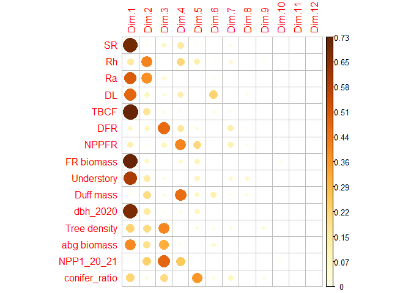
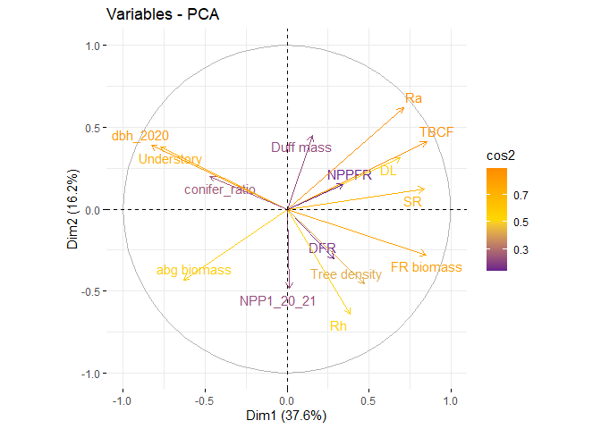
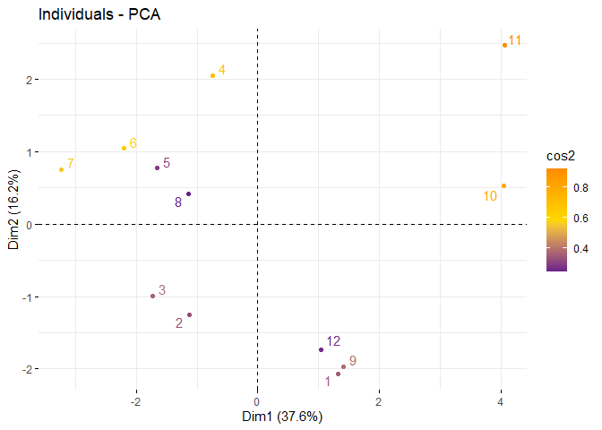

PCA - annual CBC values
================
MOEKA
2024-04-29

ref: <https://www.datacamp.com/tutorial/pca-analysis-r> ref:
<https://rpubs.com/KarolinaSzczesna/862710>

``` r
cbc_annual_raw <-
  read_sheet("https://docs.google.com/spreadsheets/d/1mAvjZZHU6QzANVULKPTnQAf7BJ7tgJtJDmgdV6Y0xLk/edit#gid=751977988", 
             range = "Copy of CBC")
```

    ## ! Using an auto-discovered, cached token.

    ##   To suppress this message, modify your code or options to clearly consent to
    ##   the use of a cached token.

    ##   See gargle's "Non-interactive auth" vignette for more details:

    ##   <https://gargle.r-lib.org/articles/non-interactive-auth.html>

    ## ℹ The googlesheets4 package is using a cached token for 'mono@tamu.edu'.

    ## ✔ Reading from "compartment_flux".

    ## ✔ Range ''Copy of CBC''.

    ## New names:
    ## • `` -> `...33`
    ## • `` -> `...52`
    ## • `` -> `...58`
    ## • `` -> `...63`
    ## • `` -> `...75`

``` r
cbc_annual <- 
  cbc_annual_raw[1:12,] %>%
  mutate(stands = substring(Site, 1,2),
         plot = as.character(substring(Site, 4,4))) %>%
  select(c(stands, plot, SR, Rh_season, Ra_season, Litter, NPP_coarse, TBCF, Understory_veg,
           `SR- Q10`, `Ra- Q10`, `Rh- Q10`,
           dcs_avg_m, dcs_avg_p, `Balance`, 
           `Duff layer (gC m-2)`, `Duff depth (cm)`, 
           `LF+DF`,`FR: 0-10 cm`, `FR: 10-20 cm`, `FR: 20-30 cm`, `FR: top 30 cm`,
           `dbh_2020 (cm)`, `dbh_2021 (cm)`, `NPP1_20_21 (g/m2)`, `NPP2_20_21 (g/m2)`, 
           `Tree density (per ac)`,`abg biomass (kg/m2)`,
            LAI_20_summer, `conifer ratio`)) %>% 
  mutate(across(3:30, as.numeric))
```

    ## Warning: There were 4 warnings in `mutate()`.
    ## The first warning was:
    ## ℹ In argument: `across(3:30, as.numeric)`.
    ## Caused by warning:
    ## ! NAs introduced by coercion
    ## ℹ Run `dplyr::last_dplyr_warnings()` to see the 3 remaining warnings.

``` r
colnames(cbc_annual) <- c("stands", "plot", "SR", "Rh", "Ra", "DL", "NPP_coarse","TBCF", "Understory",
           "SR-Q10", "Ra-Q10","Rh-Q10", "DFR", "NPPFR", "ASCB", 
           "Duff mass", "Duff depth", 
           "FR biomass","FR: 0-10 cm", "FR: 10-20 cm", "FR: 20-30 cm", "FR: top 30 cm",
           "dbh_2020", "dbh_2021", "NPP1_20_21", "NPP2_20_21", 
           "Tree density","abg biomass","LAI20", "conifer_ratio")


cbc_annual_key <- 
  cbc_annual %>% 
  select(stands, SR, Rh, Ra, DL, TBCF, DFR, NPPFR, 
         `FR biomass`, Understory, `Duff mass`, dbh_2020, `Tree density`, `abg biomass`,
         `NPP1_20_21`, `Tree density`, `abg biomass`, conifer_ratio)

summary(cbc_annual_key)
```

    ##     stands                SR             Rh              Ra       
    ##  Length:12          Min.   : 905   Min.   :425.8   Min.   :338.6  
    ##  Class :character   1st Qu.:1091   1st Qu.:569.6   1st Qu.:433.3  
    ##  Mode  :character   Median :1158   Median :664.6   Median :477.6  
    ##                     Mean   :1213   Mean   :659.1   Mean   :554.2  
    ##                     3rd Qu.:1337   3rd Qu.:749.7   3rd Qu.:605.6  
    ##                     Max.   :1612   Max.   :848.3   Max.   :909.9  
    ##        DL             TBCF             DFR            NPPFR      
    ##  Min.   :224.9   Min.   : 557.7   Min.   :117.3   Min.   :162.5  
    ##  1st Qu.:270.7   1st Qu.: 692.8   1st Qu.:167.8   1st Qu.:184.5  
    ##  Median :323.3   Median : 777.9   Median :189.6   Median :203.5  
    ##  Mean   :313.7   Mean   : 806.2   Mean   :207.5   Mean   :213.7  
    ##  3rd Qu.:345.4   3rd Qu.: 864.7   3rd Qu.:247.7   3rd Qu.:230.6  
    ##  Max.   :406.1   Max.   :1187.8   Max.   :356.0   Max.   :281.6  
    ##    FR biomass      Understory        Duff mass         dbh_2020    
    ##  Min.   :106.5   Min.   : 0.6733   Min.   : 36.88   Min.   :14.68  
    ##  1st Qu.:110.2   1st Qu.: 5.4267   1st Qu.: 68.60   1st Qu.:21.19  
    ##  Median :130.9   Median :20.1533   Median : 88.11   Median :24.51  
    ##  Mean   :133.7   Mean   :22.7678   Mean   : 90.85   Mean   :26.26  
    ##  3rd Qu.:157.2   3rd Qu.:34.8583   3rd Qu.:103.66   3rd Qu.:32.11  
    ##  Max.   :175.0   Max.   :58.7933   Max.   :148.34   Max.   :41.55  
    ##   Tree density     abg biomass       NPP1_20_21      conifer_ratio   
    ##  Min.   : 60.89   Min.   : 5.194   Min.   :  43.93   Min.   :0.1923  
    ##  1st Qu.:125.09   1st Qu.:12.441   1st Qu.: 302.79   1st Qu.:0.3081  
    ##  Median :166.32   Median :16.022   Median : 458.18   Median :0.6126  
    ##  Mean   :216.08   Mean   :15.929   Mean   : 573.17   Mean   :0.5532  
    ##  3rd Qu.:209.25   3rd Qu.:20.724   3rd Qu.: 759.32   3rd Qu.:0.7132  
    ##  Max.   :722.07   Max.   :24.265   Max.   :1616.33   Max.   :1.0000

``` r
# only env
cbc_stands <- 
  cbc_annual %>% 
  select(stands, `FR biomass`, Understory, `Duff mass`, dbh_2020, `Tree density`, `abg biomass`,
         `NPP1_20_21`, `Tree density`, `abg biomass`, conifer_ratio)
```

``` r
res.pca <- prcomp(cbc_annual_key[,-1], scale = T)
print(res.pca)
```

    ## Standard deviations (1, .., p=12):
    ##  [1] 2.373954e+00 1.558519e+00 1.501327e+00 1.387953e+00 1.088749e+00
    ##  [6] 7.583182e-01 7.519621e-01 4.508110e-01 3.728782e-01 2.771389e-01
    ## [11] 1.001033e-01 2.151536e-16
    ## 
    ## Rotation (n x k) = (15 x 12):
    ##                        PC1         PC2         PC3         PC4           PC5
    ## SR             0.352737536  0.07817115 -0.17647836  0.27814519 -0.1327645662
    ## Rh             0.162670681 -0.41193305 -0.05862131  0.33380325 -0.3267972746
    ## Ra             0.299804307  0.39667955 -0.16677650  0.08489382  0.0829290965
    ## DL             0.291152374  0.19978460 -0.13364212 -0.25597917  0.0407083068
    ## TBCF           0.359153292  0.26345101  0.10479811  0.09017707  0.0004692549
    ## DFR            0.120937210 -0.19294221  0.45479998 -0.28640612 -0.1855296129
    ## NPPFR          0.144697834  0.09625284  0.19811574 -0.46001752 -0.4199951080
    ## FR biomass     0.358074562 -0.17910332  0.06109237 -0.18236289 -0.2930327128
    ## Understory    -0.326285207  0.24344226  0.12303723  0.02793558 -0.2804713860
    ## Duff mass      0.065232000  0.28868724  0.12694128  0.48786503 -0.2670131301
    ## dbh_2020      -0.348560397  0.24914132  0.08381396  0.12560032 -0.2741497341
    ## Tree density   0.198487868 -0.29203086 -0.42264559  0.06034188 -0.1902242448
    ## abg biomass   -0.265924768 -0.27670951 -0.37582592 -0.09303449 -0.0356182845
    ## NPP1_20_21     0.006047446 -0.31062614  0.45820205  0.36377134 -0.0161825272
    ## conifer_ratio -0.198314935  0.12625970 -0.30139004 -0.06520250 -0.5545476577
    ##                       PC6          PC7         PC8         PC9         PC10
    ## SR            -0.03999339 -0.233556057 -0.18932343 -0.17446161 -0.003586532
    ## Rh             0.18568399 -0.305837740 -0.09804117 -0.32758120 -0.025159762
    ## Ra            -0.18446845 -0.052452674 -0.15300192  0.03389219  0.014279475
    ## DL             0.62344376  0.110277158 -0.28469796 -0.12647178  0.273124765
    ## TBCF          -0.23490838  0.205054880 -0.11463411  0.13263516  0.198042385
    ## DFR            0.13363706  0.481339658 -0.29544127 -0.03128587 -0.116555122
    ## NPPFR         -0.12082413 -0.443630691  0.28002602  0.29414028  0.293806050
    ## FR biomass     0.03875047 -0.057348194  0.13289845 -0.02203353 -0.491559141
    ## Understory     0.09949684 -0.320640269 -0.55033754  0.09989296  0.063474217
    ## Duff mass      0.45233452  0.205216727  0.44144582  0.30628107 -0.028455416
    ## dbh_2020      -0.04584011  0.051569178 -0.22703031  0.13423715 -0.408287970
    ## Tree density  -0.22220838  0.231949509 -0.26523398  0.56555442 -0.041346997
    ## abg biomass    0.32472792 -0.005141467  0.01799859  0.29918032  0.226893012
    ## NPP1_20_21    -0.14975877  0.050764820 -0.10983041  0.07778899  0.488824935
    ## conifer_ratio -0.24126840  0.398976930  0.14681497 -0.44979654  0.283049876
    ##                      PC11        PC12
    ## SR             0.23130064 -0.37721090
    ## Rh             0.08428976  0.50369335
    ## Ra             0.21308804  0.27666587
    ## DL            -0.45277893  0.07701117
    ## TBCF           0.20130264  0.17193096
    ## DFR            0.43680730  0.06161713
    ## NPPFR         -0.01198298  0.17969433
    ## FR biomass    -0.17050462 -0.33212960
    ## Understory     0.10838977 -0.37249882
    ## Duff mass      0.07911606 -0.09824301
    ## dbh_2020      -0.26782340  0.41692984
    ## Tree density  -0.23868106 -0.03592967
    ## abg biomass    0.42695275  0.04567308
    ## NPP1_20_21    -0.31133230 -0.10115136
    ## conifer_ratio -0.05018983 -0.09862587

``` r
summary(res.pca)
```

    ## Importance of components:
    ##                           PC1    PC2    PC3    PC4     PC5     PC6    PC7
    ## Standard deviation     2.3740 1.5585 1.5013 1.3880 1.08875 0.75832 0.7520
    ## Proportion of Variance 0.3757 0.1619 0.1503 0.1284 0.07902 0.03834 0.0377
    ## Cumulative Proportion  0.3757 0.5376 0.6879 0.8163 0.89536 0.93370 0.9714
    ##                            PC8     PC9    PC10    PC11      PC12
    ## Standard deviation     0.45081 0.37288 0.27714 0.10010 2.152e-16
    ## Proportion of Variance 0.01355 0.00927 0.00512 0.00067 0.000e+00
    ## Cumulative Proportion  0.98494 0.99421 0.99933 1.00000 1.000e+00

``` r
eig.val<-get_eigenvalue(res.pca)
eig.val
```

    ##          eigenvalue variance.percent cumulative.variance.percent
    ## Dim.1  5.635659e+00     3.757106e+01                    37.57106
    ## Dim.2  2.428982e+00     1.619321e+01                    53.76427
    ## Dim.3  2.253984e+00     1.502656e+01                    68.79083
    ## Dim.4  1.926413e+00     1.284275e+01                    81.63358
    ## Dim.5  1.185374e+00     7.902492e+00                    89.53607
    ## Dim.6  5.750465e-01     3.833643e+00                    93.36972
    ## Dim.7  5.654469e-01     3.769646e+00                    97.13936
    ## Dim.8  2.032306e-01     1.354870e+00                    98.49423
    ## Dim.9  1.390382e-01     9.269211e-01                    99.42116
    ## Dim.10 7.680596e-02     5.120397e-01                    99.93320
    ## Dim.11 1.002066e-02     6.680443e-02                   100.00000
    ## Dim.12 4.629108e-32     3.086072e-31                   100.00000

``` r
fviz_eig(res.pca, col.var="blue")
```

<!-- --> The first
two eigenvalues explain 53.76 % of the variation.

The next two graphs show the quality of representation of variables by
PC1 and PC2. The 1st graph shows the saure cosine value respect to the
first two PCs. In the second graph, positively correlated variables are
grouped together.

``` r
var <- get_pca_var(res.pca)
var
```

    ## Principal Component Analysis Results for variables
    ##  ===================================================
    ##   Name       Description                                    
    ## 1 "$coord"   "Coordinates for the variables"                
    ## 2 "$cor"     "Correlations between variables and dimensions"
    ## 3 "$cos2"    "Cos2 for the variables"                       
    ## 4 "$contrib" "contributions of the variables"

``` r
head(var$cos2)
```

    ##           Dim.1      Dim.2      Dim.3      Dim.4        Dim.5        Dim.6
    ## SR   0.70120990 0.01484285 0.07019945 0.14903643 2.089391e-02 0.0009197703
    ## Rh   0.14912939 0.41217117 0.00774572 0.21464978 1.265937e-01 0.0198267667
    ## Ra   0.50654778 0.38221167 0.06269321 0.01388358 8.152094e-03 0.0195680341
    ## DL   0.47773313 0.09695011 0.04025664 0.12622883 1.964361e-03 0.2235103046
    ## TBCF 0.72694974 0.16858700 0.02475470 0.01566540 2.610195e-07 0.0317321866
    ## DFR  0.08242607 0.09042298 0.46622083 0.15802068 4.080203e-02 0.0102696776
    ##            Dim.7       Dim.8        Dim.9       Dim.10       Dim.11
    ## SR   0.030844243 0.007284467 0.0042318840 9.879715e-07 5.361054e-04
    ## Rh   0.052890053 0.001953467 0.0149201073 4.861922e-05 7.119445e-05
    ## Ra   0.001555705 0.004757544 0.0001597104 1.566100e-05 4.550034e-04
    ## DL   0.006876429 0.016472433 0.0022239308 5.729504e-03 2.054324e-03
    ## TBCF 0.023775632 0.002670649 0.0024459713 3.012390e-03 4.060649e-04
    ## DFR  0.131007192 0.017739091 0.0001360913 1.043416e-03 1.911949e-03
    ##            Dim.12
    ## SR   6.586668e-33
    ## Rh   1.174437e-32
    ## Ra   3.543304e-33
    ## DL   2.745394e-34
    ## TBCF 1.368376e-33
    ## DFR  1.757520e-34

``` r
library("corrplot")
```

    ## corrplot 0.92 loaded

``` r
corrplot(var$cos2, is.corr=FALSE)
```

<!-- -->

``` r
fviz_cos2(res.pca, choice = "var", axes = 1:2)
```

<!-- -->

``` r
fviz_pca_var(res.pca,
             col.var = "cos2", # Color by the quality of representation
             gradient.cols = c("darkorchid4", "gold", "darkorange"),
             repel = TRUE
)
```

<!-- -->

``` r
# Contributions of variables to PC1
a<-fviz_contrib(res.pca, choice = "var", axes = 1)
# Contributions of variables to PC2
b<-fviz_contrib(res.pca, choice = "var", axes = 2)
grid.arrange(a,b, ncol=2, top='Contribution of the variables to the first two PCs')
```

<!-- -->

``` r
ind <- get_pca_ind(res.pca)
ind
```

    ## Principal Component Analysis Results for individuals
    ##  ===================================================
    ##   Name       Description                       
    ## 1 "$coord"   "Coordinates for the individuals" 
    ## 2 "$cos2"    "Cos2 for the individuals"        
    ## 3 "$contrib" "contributions of the individuals"

``` r
fviz_pca_ind(res.pca,
             col.ind = "cos2", # Color by the quality of representation
             gradient.cols = c("darkorchid4", "gold", "darkorange"),
             repel = TRUE
)
```

<!-- -->

``` r
fviz_contrib(res.pca, choice = "ind", axes = 1:2)
```

<!-- -->

``` r
autoplot(res.pca, data = cbc_annual_key, colour = "stands",
         loadings=TRUE, loadings.colour='black', loadings.label=TRUE, loadings.label.size=5, 
         frame = T) + theme_bw()
```

<!-- -->

``` r
kmeans<-eclust(cbc_annual_key[,-1], k=4) + theme_bw()
```

<!-- -->

``` r
# for stand characteristics
res.pca_std<- prcomp(cbc_stands[,-1], scale = T)

autoplot(res.pca_std, data = cbc_stands, colour = "stands",
         loadings=TRUE, loadings.colour='black', loadings.label=TRUE, loadings.label.size=5, 
         frame = T) + theme_bw()
```

<!-- -->
