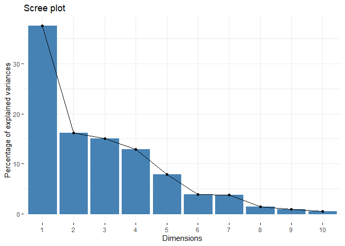
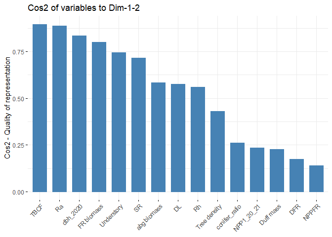

PCA - annual CBC values
================
MOEKA
2024-04-29

ref: <https://www.datacamp.com/tutorial/pca-analysis-r> ref:
<https://rpubs.com/KarolinaSzczesna/862710>

``` r
cbc_annual_raw <-
  read_sheet("https://docs.google.com/spreadsheets/d/1mAvjZZHU6QzANVULKPTnQAf7BJ7tgJtJDmgdV6Y0xLk/edit#gid=751977988", 
             range = "Copy of CBC")
```

    ## ! Using an auto-discovered, cached token.

    ##   To suppress this message, modify your code or options to clearly consent to
    ##   the use of a cached token.

    ##   See gargle's "Non-interactive auth" vignette for more details:

    ##   <https://gargle.r-lib.org/articles/non-interactive-auth.html>

    ## ℹ The googlesheets4 package is using a cached token for 'mono@tamu.edu'.

    ## ✔ Reading from "compartment_flux".

    ## ✔ Range ''Copy of CBC''.

    ## New names:
    ## • `` -> `...33`
    ## • `` -> `...52`
    ## • `` -> `...58`
    ## • `` -> `...63`
    ## • `` -> `...73`

``` r
cbc_annual <- 
  cbc_annual_raw[1:12,] %>%
  mutate(stands = substring(Site, 1,2),
         plot = as.character(substring(Site, 4,4))) %>%
  select(c(stands, plot, SR, Rh_season, Ra_season, Litter, NPP_coarse, TBCF, Understory_veg,
           `SR- Q10`, `Ra- Q10`,
           dcs_avg_m, dcs_avg_p, `NPP_fungi_new`, `Balance`, 
           `Duff layer (gC m-2)`, `Duff depth (cm)`, 
           `LF+DF`,`FR: 0-10 cm`, `FR: 10-20 cm`, `FR: 20-30 cm`, `FR: top 30 cm`,
           `dbh_2020 (cm)`, `dbh_2021 (cm)`, `NPP1_20_21 (g/m2)`, `NPP2_20_21 (g/m2)`, 
           `Tree density (per ac)`,`abg biomass (kg/m2)`)) %>% 
  mutate(across(3:28, as.numeric))

colnames(cbc_annual) <- c("stands", "plot", "SR", "Rh", "Ra", "DL", "NPP_coarse","TBCF", "Dunderstory",
           "SR-Q10", "Ra-Q10", "DFR", "NPPFR", "NPPfungi", "ASCB", 
           "Duff mass", "Duff depth", 
           "FR biomass","FR: 0-10 cm", "FR: 10-20 cm", "FR: 20-30 cm", "FR: top 30 cm",
           "dbh_2020", "dbh_2021", "NPP1_20_21", "NPP2_20_21", 
           "Tree density","abg biomass")


cbc_annual_key <- 
  cbc_annual %>% 
  select(stands, SR, Rh, Ra, DL, TBCF, DFR, NPPFR, 
         `FR biomass`,NPPfungi,
         `Dunderstory`, `Duff mass`, dbh_2020, `Tree density`, `abg biomass`,
         `NPP1_20_21`)

summary(cbc_annual_key)
```

    ##     stands                SR             Rh              Ra       
    ##  Length:12          Min.   : 905   Min.   :425.8   Min.   :338.6  
    ##  Class :character   1st Qu.:1091   1st Qu.:569.6   1st Qu.:433.3  
    ##  Mode  :character   Median :1158   Median :664.6   Median :477.6  
    ##                     Mean   :1213   Mean   :659.1   Mean   :554.2  
    ##                     3rd Qu.:1337   3rd Qu.:749.7   3rd Qu.:605.6  
    ##                     Max.   :1612   Max.   :848.3   Max.   :909.9  
    ##        DL             TBCF             DFR            NPPFR      
    ##  Min.   :224.9   Min.   : 549.1   Min.   :117.3   Min.   :162.5  
    ##  1st Qu.:270.7   1st Qu.: 690.1   1st Qu.:167.8   1st Qu.:184.5  
    ##  Median :323.3   Median : 772.1   Median :189.6   Median :203.5  
    ##  Mean   :313.7   Mean   : 801.3   Mean   :207.5   Mean   :213.7  
    ##  3rd Qu.:345.4   3rd Qu.: 850.1   3rd Qu.:247.7   3rd Qu.:230.6  
    ##  Max.   :406.1   Max.   :1187.8   Max.   :356.0   Max.   :281.6  
    ##    FR biomass       NPPfungi        Dunderstory        Duff mass     
    ##  Min.   :106.5   Min.   :-121.53   Min.   : 0.6733   Min.   : 36.88  
    ##  1st Qu.:110.2   1st Qu.: -68.71   1st Qu.: 5.4267   1st Qu.: 68.60  
    ##  Median :130.9   Median : -22.26   Median :20.1533   Median : 88.11  
    ##  Mean   :133.7   Mean   : -24.90   Mean   :22.7678   Mean   : 90.85  
    ##  3rd Qu.:157.2   3rd Qu.:  20.06   3rd Qu.:34.8583   3rd Qu.:103.66  
    ##  Max.   :175.0   Max.   :  95.63   Max.   :58.7933   Max.   :148.34  
    ##     dbh_2020      Tree density     abg biomass       NPP1_20_21     
    ##  Min.   :14.68   Min.   : 60.89   Min.   : 5.194   Min.   :  43.93  
    ##  1st Qu.:21.19   1st Qu.:125.09   1st Qu.:12.441   1st Qu.: 302.79  
    ##  Median :24.51   Median :166.32   Median :16.022   Median : 458.18  
    ##  Mean   :26.26   Mean   :216.08   Mean   :15.929   Mean   : 573.17  
    ##  3rd Qu.:32.11   3rd Qu.:209.25   3rd Qu.:20.724   3rd Qu.: 759.32  
    ##  Max.   :41.55   Max.   :722.07   Max.   :24.265   Max.   :1616.33

``` r
res.pca <- prcomp(cbc_annual_key[,-1], scale = T)
print(res.pca)
```

    ## Standard deviations (1, .., p=12):
    ##  [1] 2.340161e+00 1.662107e+00 1.523488e+00 1.389404e+00 1.042133e+00
    ##  [6] 8.213854e-01 6.551308e-01 4.499325e-01 3.055703e-01 1.238784e-01
    ## [11] 9.229870e-02 3.644859e-16
    ## 
    ## Rotation (n x k) = (15 x 12):
    ##                       PC1          PC2         PC3         PC4          PC5
    ## SR            0.358311884  0.163904853  0.08059836 -0.28773054 -0.184946153
    ## Rh            0.166713667 -0.248045223  0.30592436 -0.31685220 -0.465300547
    ## Ra            0.303456821  0.377880427 -0.12961455 -0.10879514  0.122938880
    ## DL            0.294790371  0.217367190 -0.02770051  0.23852550  0.119336560
    ## TBCF          0.365954304  0.096302504 -0.26631049 -0.10274162  0.129194737
    ## DFR           0.126099781 -0.430442696 -0.25059498  0.31022863 -0.018346350
    ## NPPFR         0.148584497  0.018779719 -0.20328868  0.46930116 -0.521135609
    ## FR biomass    0.367643169 -0.157567792  0.05526421  0.18959508 -0.278441312
    ## NPPfungi      0.077330138 -0.485259092 -0.15456017 -0.04644524  0.406489625
    ## Dunderstory  -0.332350632  0.141269765 -0.23473759 -0.02537594 -0.368810156
    ## Duff mass     0.071396964  0.076687546 -0.31665215 -0.49792649 -0.094808984
    ## dbh_2020     -0.346774359  0.105849782 -0.23601677 -0.13518919 -0.162748774
    ## Tree density  0.216904379 -0.035504964  0.47729299 -0.08519618  0.008787244
    ## abg biomass  -0.262548974 -0.002492451  0.46666737  0.07833427 -0.001472801
    ## NPP1_20_21   -0.001683325 -0.477541387 -0.15393924 -0.32046037 -0.130327832
    ##                      PC6          PC7         PC8         PC9        PC10
    ## SR           -0.04886154 -0.007378236  0.18544430 -0.08063791 -0.29779257
    ## Rh            0.07440572 -0.215205459  0.10730471 -0.18461026 -0.39013761
    ## Ra           -0.11298968  0.149863571  0.14155736  0.04013864 -0.06674395
    ## DL            0.47834903 -0.444397359  0.32023595  0.22551272  0.11531827
    ## TBCF         -0.09501718  0.244798865  0.05652849  0.22463776 -0.20138274
    ## DFR           0.22971322  0.026695632  0.38347989 -0.11289107 -0.02047251
    ## NPPFR        -0.03505024  0.202522884 -0.39320696  0.34796753 -0.22866971
    ## FR biomass    0.10042744  0.057380499 -0.12991238 -0.41157010  0.44605853
    ## NPPfungi      0.27060073  0.230686216 -0.10552393 -0.02470696 -0.40147832
    ## Dunderstory   0.14742460  0.099421149  0.45108606  0.17568668 -0.04541338
    ## Duff mass     0.52971266 -0.080035064 -0.44985315  0.08402839  0.20773922
    ## dbh_2020      0.22532379  0.395813436  0.17082423 -0.30590808  0.02929166
    ## Tree density  0.16774499  0.619540627  0.16765960  0.23253017  0.30807119
    ## abg biomass   0.36575976 -0.013235757 -0.10959319  0.33792775 -0.18772667
    ## NPP1_20_21   -0.29855919 -0.136222362  0.15323908  0.50288110  0.33424098
    ##                     PC11          PC12
    ## SR            0.09675757 -0.4089138939
    ## Rh           -0.15141537  0.3017573142
    ## Ra            0.22675088 -0.1898243901
    ## DL           -0.43847370  0.0409244842
    ## TBCF          0.08750817  0.5170851721
    ## DFR           0.51727238  0.2018362614
    ## NPPFR        -0.16992231 -0.0429599735
    ## FR biomass    0.06302947 -0.2236113161
    ## NPPfungi     -0.27321063 -0.3996781914
    ## Dunderstory   0.10519484 -0.3485440957
    ## Duff mass     0.21267785  0.0334093980
    ## dbh_2020     -0.34466299  0.2326255776
    ## Tree density -0.11193760  0.0404112104
    ## abg biomass   0.37584581 -0.0004510917
    ## NPP1_20_21   -0.11152112 -0.0772757830

``` r
summary(res.pca)
```

    ## Importance of components:
    ##                           PC1    PC2    PC3    PC4    PC5     PC6     PC7
    ## Standard deviation     2.3402 1.6621 1.5235 1.3894 1.0421 0.82139 0.65513
    ## Proportion of Variance 0.3651 0.1842 0.1547 0.1287 0.0724 0.04498 0.02861
    ## Cumulative Proportion  0.3651 0.5493 0.7040 0.8327 0.9051 0.95008 0.97869
    ##                           PC8     PC9    PC10    PC11      PC12
    ## Standard deviation     0.4499 0.30557 0.12388 0.09230 3.645e-16
    ## Proportion of Variance 0.0135 0.00622 0.00102 0.00057 0.000e+00
    ## Cumulative Proportion  0.9922 0.99841 0.99943 1.00000 1.000e+00

``` r
eig.val<-get_eigenvalue(res.pca)
eig.val
```

    ##          eigenvalue variance.percent cumulative.variance.percent
    ## Dim.1  5.476353e+00     3.650902e+01                    36.50902
    ## Dim.2  2.762599e+00     1.841732e+01                    54.92635
    ## Dim.3  2.321017e+00     1.547344e+01                    70.39979
    ## Dim.4  1.930443e+00     1.286962e+01                    83.26941
    ## Dim.5  1.086040e+00     7.240269e+00                    90.50968
    ## Dim.6  6.746740e-01     4.497827e+00                    95.00751
    ## Dim.7  4.291964e-01     2.861309e+00                    97.86882
    ## Dim.8  2.024393e-01     1.349595e+00                    99.21841
    ## Dim.9  9.337318e-02     6.224879e-01                    99.84090
    ## Dim.10 1.534586e-02     1.023057e-01                    99.94321
    ## Dim.11 8.519051e-03     5.679367e-02                   100.00000
    ## Dim.12 1.328500e-31     8.856667e-31                   100.00000

``` r
fviz_eig(res.pca, col.var="blue")
```

<!-- --> The first
two eigenvalues explain 54.93 % of the variation.

The next two graphs show the quality of representation of variables by
PC1 and PC2. The 1st graph shows the saure cosine value respect to the
first two PCs. In the second graph, positively correlated variables are
grouped together.

``` r
var <- get_pca_var(res.pca)
var
```

    ## Principal Component Analysis Results for variables
    ##  ===================================================
    ##   Name       Description                                    
    ## 1 "$coord"   "Coordinates for the variables"                
    ## 2 "$cor"     "Correlations between variables and dimensions"
    ## 3 "$cos2"    "Cos2 for the variables"                       
    ## 4 "$contrib" "contributions of the variables"

``` r
head(var$cos2)
```

    ##           Dim.1      Dim.2       Dim.3      Dim.4        Dim.5       Dim.6
    ## SR   0.70309478 0.07421666 0.015077548 0.15981920 0.0371480975 0.001610750
    ## Rh   0.15220673 0.16997284 0.217223288 0.19380747 0.2351327375 0.003735137
    ## Ra   0.50429569 0.39448145 0.038992922 0.02284946 0.0164143799 0.008613340
    ## DL   0.47590256 0.13052863 0.001780959 0.10983144 0.0154665340 0.154377423
    ## TBCF 0.73340720 0.02562082 0.164609476 0.02037745 0.0181274042 0.006091136
    ## DFR  0.08708034 0.51185681 0.145754843 0.18578935 0.0003655488 0.035601309
    ##             Dim.7        Dim.8        Dim.9       Dim.10       Dim.11
    ## SR   2.336475e-05 0.0069618029 0.0006071566 1.360877e-03 7.975558e-05
    ## Rh   1.987754e-02 0.0023309465 0.0031822466 2.335753e-03 1.953130e-04
    ## Ra   9.639360e-03 0.0040565763 0.0001504345 6.836204e-05 4.380152e-04
    ## DL   8.476157e-02 0.0207603603 0.0047485854 2.040739e-04 1.637866e-03
    ## TBCF 2.572023e-02 0.0006468887 0.0047118091 6.223514e-04 6.523617e-05
    ## DFR  3.058697e-04 0.0297700735 0.0011899845 6.431812e-06 2.279448e-03
    ##            Dim.12
    ## SR   2.221393e-32
    ## Rh   1.209699e-32
    ## Ra   4.787024e-33
    ## DL   2.224990e-34
    ## TBCF 3.552105e-32
    ## DFR  5.412027e-33

``` r
library("corrplot")
```

    ## corrplot 0.92 loaded

``` r
corrplot(var$cos2, is.corr=FALSE)
```

<!-- -->

``` r
fviz_cos2(res.pca, choice = "var", axes = 1:2)
```

<!-- -->

``` r
fviz_pca_var(res.pca,
             col.var = "cos2", # Color by the quality of representation
             gradient.cols = c("darkorchid4", "gold", "darkorange"),
             repel = TRUE
)
```

<!-- -->

``` r
# Contributions of variables to PC1
a<-fviz_contrib(res.pca, choice = "var", axes = 1)
# Contributions of variables to PC2
b<-fviz_contrib(res.pca, choice = "var", axes = 2)
grid.arrange(a,b, ncol=2, top='Contribution of the variables to the first two PCs')
```

<!-- -->

``` r
ind <- get_pca_ind(res.pca)
ind
```

    ## Principal Component Analysis Results for individuals
    ##  ===================================================
    ##   Name       Description                       
    ## 1 "$coord"   "Coordinates for the individuals" 
    ## 2 "$cos2"    "Cos2 for the individuals"        
    ## 3 "$contrib" "contributions of the individuals"

``` r
fviz_pca_ind(res.pca,
             col.ind = "cos2", # Color by the quality of representation
             gradient.cols = c("darkorchid4", "gold", "darkorange"),
             repel = TRUE
)
```

<!-- -->

``` r
fviz_contrib(res.pca, choice = "ind", axes = 1:2)
```

<!-- -->

``` r
autoplot(res.pca, loadings=TRUE, loadings.colour='darkorchid4', loadings.label=TRUE, loadings.label.size=3) + theme_bw()
```

<!-- -->

``` r
kmeans<-eclust(cbc_annual_key[,-1], k=4) + theme_bw()
```

<!-- -->
