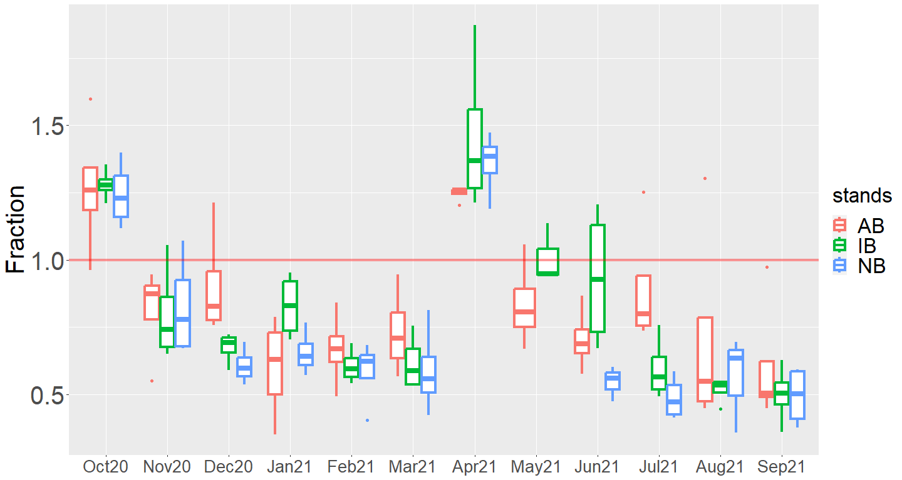
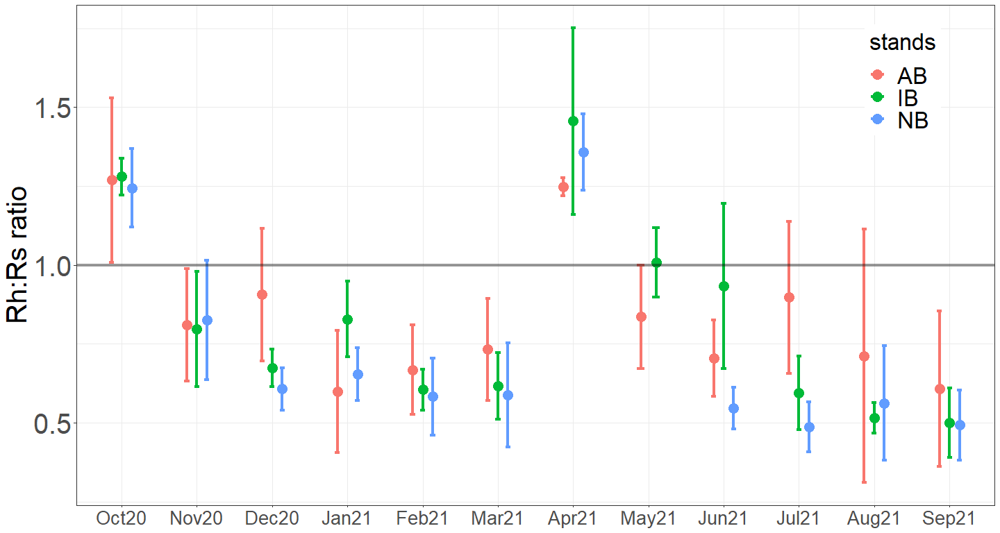
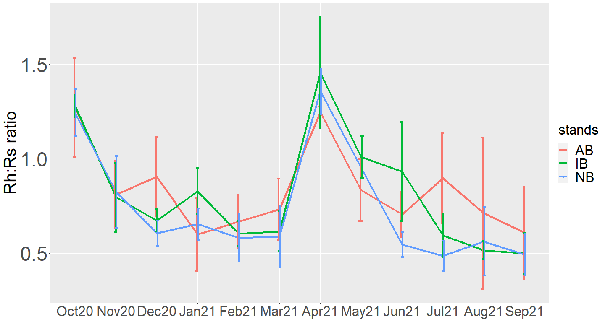
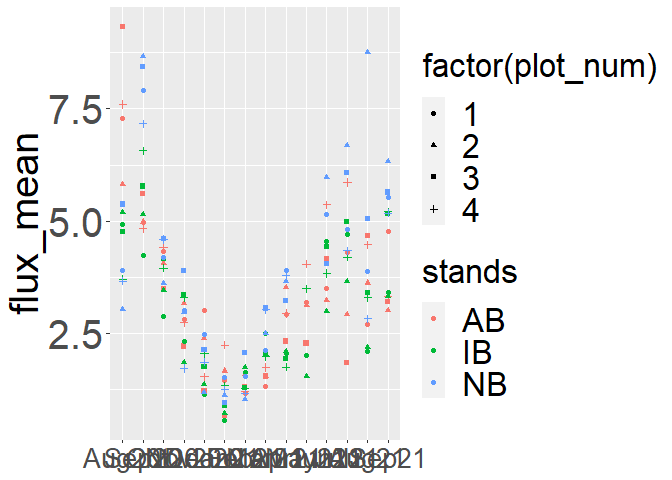
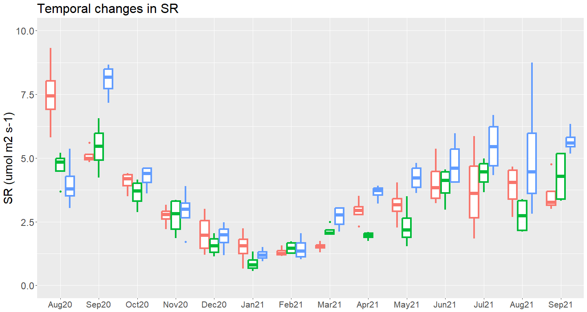
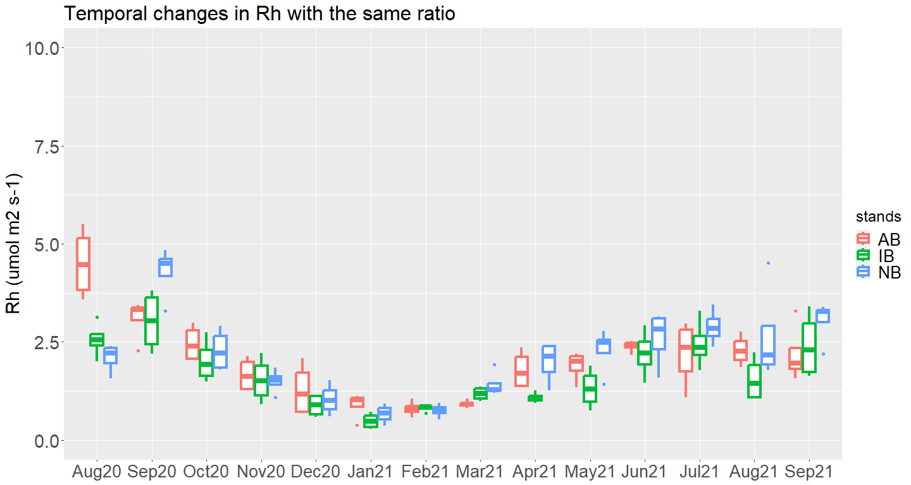
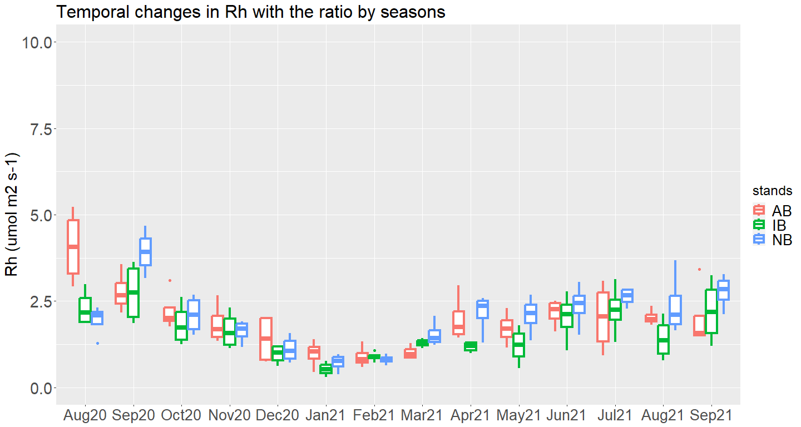
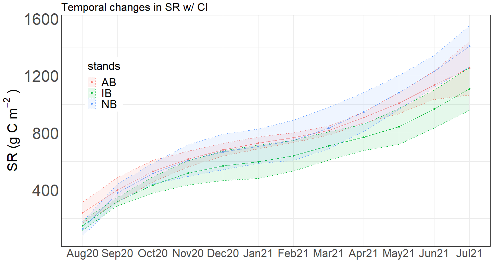
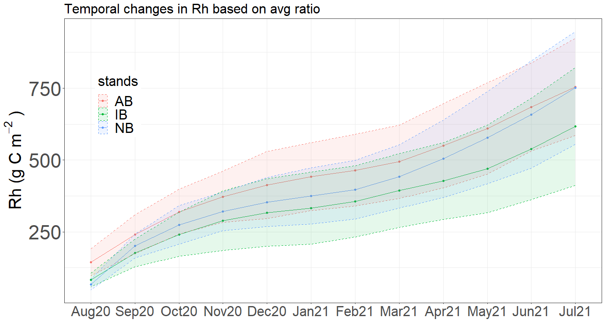
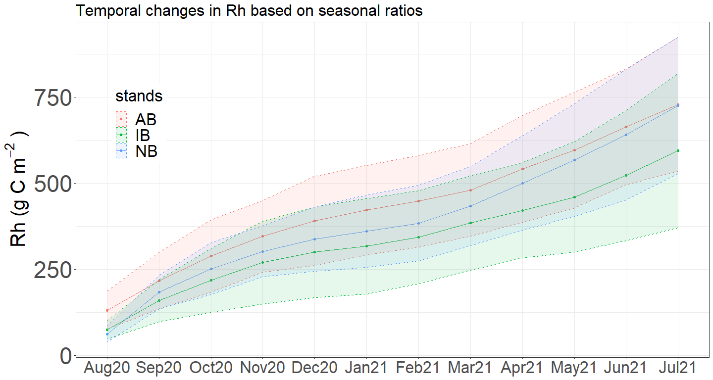

SR_graph_v9
================
Moeka
2023-08-22

##################################################################### 

This program is to organize and visualize variables measured by
LI-8100A. The quality check of measurements should be done in advance
through SoilFluxPro and the data should be exported to cvs files.
\####################################################################

Version 9: Last update: Aug 22, 2023 1. exponential decay curve

Version 8: Last update: Aug 16, 2023 1. Fix to daily accumulation

Version 6: Last update: Oct 27, 2021 1. Separate a basic part of a code
to other processes 2. Fix minor issues (Updated Mar 15, 2021)

Version 5: Last update: Aug 12, 2021 1. Adjusted flux values based on
the plot-mean initial ratio

Version 4: Last update: May 23, 2021 1. Fixed the issue that C10 was
recognized as C1. 2. Include manual Ts & vwc data 3. Include Q10
estimation 4. Include the temporal changes in fraction

Version 3: Added the summary (last update: May 11, 2021) Read the
processed SR data. Label Rs and Rh. Produce plot and stand summaries.

Version 2: Feb 22 2021 by Moeka Ono

``` r
library(ggplot2)
library(parsedate)
library(tidyr)
library(dplyr)
```

    ## 
    ## Attaching package: 'dplyr'

    ## The following objects are masked from 'package:stats':
    ## 
    ##     filter, lag

    ## The following objects are masked from 'package:base':
    ## 
    ##     intersect, setdiff, setequal, union

``` r
library(broom)
library(gridExtra)
```

    ## 
    ## Attaching package: 'gridExtra'

    ## The following object is masked from 'package:dplyr':
    ## 
    ##     combine

``` r
setwd("G:/Shared drives/Project_CooksBranch/Data/SR/Processed data")
```

## Data cleaning

Do these before importing a data frame to R: (1) Check the quality of
each observation. If necessary, cut the initial and the last observation
to have a clean regression line. (2) Export the flux summary flux from
the soil flux pro to a csv file, or a google spread sheet. (3) Creating
a new column called “Flux” to store flux estimations with higher R2
values from linear and exponential regression lines. \* CAN BE DONE WITH
R LATER.  
(4) Creating a new column called “fraction” and then calculate the ratio
of the flux of CO2 from deep collars and Rs manually only for the deep
installation months. \* COULD BE IMPROVED IN THE FUTURE.

The first chunk is basically for creating a clean, suitable data frame
for the later processes. This part includes 3 processes: (1) separating
columns to have only one info in a cell, (2) assigning the observation
months, and (3) applying the initial flux differences.

- Cleaned csv files called “summer_2” and “winter_2” are already in the
  folder.
- If you don’t have to revise the semi-original files, skip the first
  chunk then go to the next one.

``` r
knitr::opts_chunk$set(eval = FALSE)

sr<- read.csv("CBC_SR.csv",header=T,sep = ",")


##  (1) separating columns to have only one info in a cell

# Comments for the CBC project was like Abp1c1
sr$stands<-substring(sr$Comments, 1,2) 
sr$plot_num<-substring(sr$Comments, 4,4)
sr$stands<-toupper(sr$stands)   #Capital letters

sr$col_num<-NA
for (i in 1:nrow(sr)){
  if(nchar(sr$Comments[i]) == 6){sr$col_num[i]<-substring(sr$Comments[i], 6,6)}
  else if(nchar(sr$Comments[i]) == 7){sr$col_num[i]<-substring(sr$Comments[i],6,7)}
  else if(nchar(sr$Comments[i]) > 7){sr$col_num[i]<-substring(sr$Comments[i], 6,6)}
}


sr$collar<-NA
for (i in 1:nrow(sr)){
  if(as.numeric(sr$col_num[i]) %% 2 == 0){sr$collar[i] = "deep"}
  else if(as.numeric(sr$col_num[i]) %% 2 != 0){sr$collar[i] = "shallow"}
}

sr$ID<-paste0(sr$stands,"P",sr$plot_num,"C",sr$col_num) # ex) ABP1C1


## (2) assigning the observation months

sr$Date_IV<-parse_date(sr$Date_IV)   #yyyy/mm/dd to yyyy-mm-dd
sr$MY<-NA
sr$MY[sr$Date_IV > "2020-07-27" & sr$Date_IV < "2020-08-15"] = "Aug20"
sr$MY[sr$Date_IV > "2020-09-01" & sr$Date_IV < "2020-09-12"] = "Sep20"
sr$MY[sr$Date_IV > "2020-09-29" & sr$Date_IV < "2020-10-17"] = "Oct20"
sr$MY[sr$Date_IV > "2020-10-29" & sr$Date_IV < "2020-11-19"] = "Nov20"
sr$MY[sr$Date_IV > "2020-12-01" & sr$Date_IV < "2020-12-30"] = "Dec20"
sr$MY[sr$Date_IV > "2021-01-05" & sr$Date_IV < "2021-01-16"] = "Jan21"
sr$MY[sr$Date_IV > "2021-02-01" & sr$Date_IV < "2021-02-13"] = "Feb21"
sr$MY[sr$Date_IV > "2021-03-04" & sr$Date_IV < "2021-03-20"] = "Mar21"
sr$MY[sr$Date_IV > "2021-04-08" & sr$Date_IV < "2021-04-28"] = "Apr21"
sr$MY[sr$Date_IV > "2021-05-09" & sr$Date_IV < "2021-05-28"] = "May21"
sr$MY[sr$Date_IV > "2021-06-09" & sr$Date_IV < "2021-07-08"] = "Jun21"
sr$MY[sr$Date_IV > "2021-07-14" & sr$Date_IV < "2021-08-03"] = "Jul21"
sr$MY[sr$Date_IV > "2021-08-24" & sr$Date_IV < "2021-09-14"] = "Aug21"
sr$MY[sr$Date_IV > "2021-09-16" & sr$Date_IV < "2021-09-28"] = "Sep21"


## (3) applying the initial flux differences
sr$Flux_adj<-NA

# Oct20 and Apr21 were the months we installed the collars
# Calculate the difference of the flux at the collar location selection

Flux_adj<-sr[sr$MY == "Oct20" & is.na(sr$fraction)== FALSE | sr$MY == "Apr21" & is.na(sr$fraction)== FALSE,]

Flux_adj_plt<-Flux_adj %>%
  group_by(stands,plot_num,MY) %>%
  summarise(fraction_mean=mean(fraction)) %>%
  ungroup() %>%
  arrange(MY) %>%
  arrange(match(MY,c("Oct20","Apr21")))


sr$Flux_adj<-as.numeric(sr$Flux_adj)

winter<-sr[sr$MY == "Aug20"|sr$MY == "Sep20"|sr$MY == "Oct20"|sr$MY == "Nov20"|sr$MY == "Dec20"| sr$MY == "Jan21"|sr$MY == "Feb21"|sr$MY == "Mar21",]
summer<-sr[sr$MY == "Apr21"|sr$MY == "May21"|sr$MY == "Jun21"| sr$MY == "Jul21"|sr$MY == "Aug21"|sr$MY == "Sep21",]

# Apply the plot averaged initial collar difference to each deep collar measurement. Assume short collar collection is pure Rs.

for(i in 1:nrow(winter)){
  if(winter$collar[i]=="deep" & winter$MY[i] == "Oct21"){winter$Flux_adj[i]<-winter$Flux[i]}
  else if(winter$collar[i]=="deep" & winter$stands[i] == "AB"){winter$Flux_adj[i]<- winter$Flux[i]/Flux_adj_plt$fraction_mean[as.numeric(winter$plot_num[i])]}
  else if(winter$collar[i]=="deep" & winter$stands[i] == "IB"){winter$Flux_adj[i]<- winter$Flux[i]/Flux_adj_plt$fraction_mean[as.numeric(as.numeric(winter$plot_num[i])+4)]}
  else if(winter$collar[i]=="deep" & winter$stands[i] == "NB"){winter$Flux_adj[i]<- winter$Flux[i]/Flux_adj_plt$fraction_mean[as.numeric(as.numeric(winter$plot_num[i])+8)]}
  else{winter$Flux_adj[i]<-winter$Flux[i]} # This is for shallow collars assuming the pure flux measurement is Rs.
}

for(i in 1:nrow(summer)){
  if(summer$collar[i]=="deep" & summer$MY[i] == "Apr21"){summer$Flux_adj[i]<-summer$Flux[i]}
  else if(summer$collar[i]=="deep" & summer$stands[i] == "AB"){summer$Flux_adj[i]<- summer$Flux[i]/Flux_adj_plt$fraction_mean[as.numeric(summer$plot_num[i])+12]}
  else if(summer$collar[i]=="deep" & summer$stands[i] == "IB"){summer$Flux_adj[i]<- summer$Flux[i]/Flux_adj_plt$fraction_mean[as.numeric(as.numeric(summer$plot_num[i])+16)]}
  else if(summer$collar[i]=="deep" & summer$stands[i] == "NB"){summer$Flux_adj[i]<- summer$Flux[i]/Flux_adj_plt$fraction_mean[as.numeric(as.numeric(summer$plot_num[i])+20)]}
  else{summer$Flux_adj[i]<-summer$Flux[i]} # This is for shallow collars assuming the pure flux measurement is Rs.
}

#setwd("C:/Users/m0eka/documents")
#write.csv(winter,"winter_1.csv")
#write.csv(summer,"summer_1.csv")
```

After exporting the data frames, you will need to calculate the ratio of
the flux of CO2 from deep collars and Rs manually. (This is something I
could improve in the future.) Firstly, the exported csv files above
should include 26 columns as below:

\#\[1\] “Date_IV” “Comments” “Offset”  
\#\[4\] “CrvFitStatus” “Exp_Flux” “Exp_FluxCV”  
\#\[7\] “Exp_R2” “Exp_Iter” “Lin_Flux”  
\#\[10\] “Lin_FluxCV” “Lin_R2” “Observation.Length” \#\[13\] “V1_Mean”
“Tcham_IV” “Cdry_Mean”  
\#\[16\] “Pressure_IV” “H2O_IV” “Flux”  
\#\[19\] “fraction” “stands” “plot_num”  
\#\[22\] “col_num” “ID” “collar”  
\#\[25\] “MY” “Flux_adj”

Then, create a new column called “fraction_adj” for the ratio of the
flux of CO2 from deep collars and Rs for each pair of collars AFTER
FIXING THE INITIAL FLUX DIFFERENCES. In the csv files, manually
calculate these values and stored in the shallow collars’ rows.

``` r
winter_2<-read.csv("Processed data/winter_2.csv",header = T,sep=",")
summer_2<-read.csv("Processed data/summer_2.csv",header = T,sep=",")

# Changing a style from May-20 to May20, for example
for (i in 1:nrow(winter_2)){
  winter_2$MY[i] <- paste(substring(winter_2$MY[i],4,6),substring(winter_2$MY[i],1,2),sep = "")
}

for (i in 1:nrow(summer_2)){
  summer_2$MY[i] <- paste(substring(summer_2$MY[i],4,6),substring(summer_2$MY[i],1,2),sep = "")
}

# Making a data frame for a whole observation season
sr_yr<-rbind(winter_2,summer_2)
sr_yr<-sr_yr[,-1]

# The data frame should include these 27 columns 

### colnames(sr_yr)
#[1] "Date_IV"            "Comments"           "Offset"            
#[4] "CrvFitStatus"       "Exp_Flux"           "Exp_FluxCV"        
#[7] "Exp_R2"             "Exp_Iter"           "Lin_Flux"          
#[10] "Lin_FluxCV"         "Lin_R2"             "Observation.Length"
#[13] "V1_Mean"            "Tcham_IV"           "Cdry_Mean"         
#[16] "Pressure_IV"        "H2O_IV"             "Flux"              
#[19] "fraction"           "stands"             "plot_num"          
#[22] "col_num"            "ID"                 "collar"            
#[25] "MY"                 "Flux_adj"           "fraction_adj"  
```

## Estimatin the ratio of Rh/Rs

Okay, so far, we have calculated values of Rs, the adjusted flux of CO2
from deep collars (\*both are stored in “Flux_adj”), and the ratio of
the adjusted flux of CO2 from deep collars and Rs. Now, we want to
determine the ratio of Rh/Rs at the stabilization periods.

``` r
MY_order <- c("Aug20","Sep20","Oct20","Nov20","Dec20","Jan21","Feb21",
              "Mar21","Apr21","May21","Jun21","Jul21","Aug21","Sep21")

## Average fluxes by plot
sr_plmean<-sr_yr %>%
  group_by(stands,plot_num,collar,MY) %>%
  summarise(flux_mean=mean(Flux_adj),fraction_mean=mean(fraction_adj,na.rm=TRUE)) %>%
  ungroup() %>%
  arrange(match(MY,MY_order))
```

    ## `summarise()` has grouped output by 'stands', 'plot_num', 'collar'. You can
    ## override using the `.groups` argument.

``` r
sr_st_fraction <- sr_plmean %>%
 filter(collar == "shallow") %>%
 group_by(stands, MY) %>%
 summarise_each(funs(mean(., na.rm = TRUE),sd(., na.rm = TRUE)), fraction_mean)
```

    ## Warning: `summarise_each_()` was deprecated in dplyr 0.7.0.
    ## ℹ Please use `across()` instead.
    ## ℹ The deprecated feature was likely used in the dplyr package.
    ##   Please report the issue at <https://github.com/tidyverse/dplyr/issues>.
    ## This warning is displayed once every 8 hours.
    ## Call `lifecycle::last_lifecycle_warnings()` to see where this warning was
    ## generated.

    ## Warning: `funs()` was deprecated in dplyr 0.8.0.
    ## ℹ Please use a list of either functions or lambdas:
    ## 
    ## # Simple named list: list(mean = mean, median = median)
    ## 
    ## # Auto named with `tibble::lst()`: tibble::lst(mean, median)
    ## 
    ## # Using lambdas list(~ mean(., trim = .2), ~ median(., na.rm = TRUE))
    ## Call `lifecycle::last_lifecycle_warnings()` to see where this warning was
    ## generated.

``` r
sr_stmean_ratio <- sr_plmean %>%
  filter(collar == "shallow") %>%
  group_by(stands, MY) %>%
  summarise_each(funs(mean(., na.rm = TRUE),sd(., na.rm = TRUE)), fraction_mean)
```

    ## Warning: `funs()` was deprecated in dplyr 0.8.0.
    ## ℹ Please use a list of either functions or lambdas:
    ## 
    ## # Simple named list: list(mean = mean, median = median)
    ## 
    ## # Auto named with `tibble::lst()`: tibble::lst(mean, median)
    ## 
    ## # Using lambdas list(~ mean(., trim = .2), ~ median(., na.rm = TRUE))
    ## Call `lifecycle::last_lifecycle_warnings()` to see where this warning was
    ## generated.

``` r
sr_stmean_ratio <- sr_stmean_ratio[sr_stmean_ratio$MY != "Aug20" & sr_stmean_ratio$MY != "Sep20",]
```

``` r
#### Temporal fraction changes - box plots ####
ggplot(sr_plmean,aes(x=factor(MY, level = MY_order),y=fraction_mean,col=stands))+
  geom_boxplot(data=subset(sr_plmean,collar=="shallow"& MY!= "Aug20"& MY!="Sep20"),lwd=1.5)+
  geom_hline(yintercept=1, color="red", size=1.5, alpha=0.4)+
  ylab("Fraction")+#ggtitle("Temporal changes in fraction")+
  theme(axis.title.x = element_blank(),axis.text.x = element_text(size = 20),
        axis.title.y = element_text(size = 30),axis.text.y = element_text(size = 30),
        legend.title = element_text(size = 25),legend.text = element_text(size = 25))
```

    ## Warning: Using `size` aesthetic for lines was deprecated in ggplot2 3.4.0.
    ## ℹ Please use `linewidth` instead.
    ## This warning is displayed once every 8 hours.
    ## Call `lifecycle::last_lifecycle_warnings()` to see where this warning was
    ## generated.

    ## Warning: Removed 1 rows containing non-finite values (`stat_boxplot()`).

<!-- -->

``` r
#### Temporal fraction changes - bar +- sd ####
ggplot(subset(sr_st_fraction,! MY %in% c("Aug20", "Sep20")),
       aes(x=factor(MY, level = MY_order),y=mean,col=stands))+
  geom_point(size = 5,position=position_dodge(0.4))+
  geom_errorbar(aes(ymin=mean-sd, ymax=mean+sd),lwd=1.5, width=.2,position=position_dodge(0.4))+
  geom_hline(yintercept=1, color="black", size=1.5, alpha=0.4)+
  ylab("Rh:Rs ratio")+theme_bw() +#ggtitle("Temporal changes in fraction")+
  theme(axis.title.x = element_blank(),axis.text.x = element_text(size = 20),
        axis.title.y = element_text(size = 30),axis.text.y = element_text(size = 30),
        legend.title = element_text(size = 25),legend.text = element_text(size = 25),
        legend.position = c(.9,.85))
```

<!-- -->

``` r
### temporal changes - line graph ##
ggplot(sr_stmean_ratio,aes(x=factor(MY, level = MY_order),y=mean,col=stands,group= stands))+
  geom_line(lwd = 1.5) + geom_point(stat="identity")+
  geom_errorbar(aes(ymin=mean-sd, ymax=mean+sd),lwd=1.5, width=.2,position=position_dodge(0.05))+
  ylab("Rh:Rs ratio")+#ggtitle("Temporal changes in Rh")+
  theme(axis.title.x = element_blank(),axis.text.x = element_text(size =25),
        axis.title.y = element_text(size = 30),axis.text.y = element_text(size = 35),
        title = element_text(size = 20),legend.title = element_text(size = 25),legend.text = element_text(size = 25))
```

<!-- -->

The fraction in ABP1C1 & C2 at the Sep21 measurement was about 2 which
was more than 2 times larger than other collars’ values. This collar
specific fraction value was removed as an outlier. (The graph includes
the outlier but it was excluded in the table.) Although NBP3 in Feb21
was also lower than other plots in the NB stand, all the collar were
around the same values (0.4), therefore, decided to keep them.

``` r
sr_plmean_rm_outlier <- sr_yr %>%
   filter(!row_number()==1233) %>%
  group_by(stands,plot_num,collar,MY) %>%
  summarise(flux_mean=mean(Flux_adj),fraction_mean=mean(fraction_adj,na.rm=TRUE)) %>%
  ungroup() %>%
  arrange(match(MY,MY_order))
```

    ## `summarise()` has grouped output by 'stands', 'plot_num', 'collar'. You can
    ## override using the `.groups` argument.

``` r
# Boxplot
ggplot(sr_plmean_rm_outlier,aes(x=factor(MY, level = MY_order),y=fraction_mean,col=stands))+
    geom_boxplot(data=subset(sr_plmean_rm_outlier,collar=="shallow"& MY!= "Aug20"& MY!="Sep20"),lwd=1.5)+
    geom_hline(yintercept=1, color="red", size=1.5, alpha=0.4)+
    ylab("Fraction")+#ggtitle("Temporal changes in fraction")+
    theme(axis.title.x = element_blank(),axis.text.x = element_text(size = 20),
          axis.title.y = element_text(size = 30),axis.text.y = element_text(size = 30),
          legend.title = element_text(size = 25),legend.text = element_text(size = 25))
```

    ## Warning: Removed 1 rows containing non-finite values (`stat_boxplot()`).

<!-- -->

``` r
# Bar +- SD
```

``` r
fraction_yr_dorm <-
  sr_plmean_rm_outlier %>%
  filter(collar == "shallow") %>%
  filter(MY %in% c("Oct20","Nov20","Dec20","Jan21","Feb21","Mar21")) %>%
  select(!c(collar, flux_mean))

fraction_yr_dorm$M <- as.numeric(factor(match(fraction_yr_dorm$MY, MY_order))) - 1
  
fraction_yr_grow <-
  sr_plmean_rm_outlier %>%
  filter(collar == "shallow") %>%
  filter(! MY %in% c("Aug20","Sep20","Oct20","Nov20",
                     "Dec20","Jan21","Feb21","Mar21")) %>%
  select(!c(collar, flux_mean))

fraction_yr_grow$M <- as.numeric(factor(match(fraction_yr_grow$MY, MY_order))) - 1

## Exponential decay curve: y = yf n+ (y0-yf) * exp(-alpha * Month)
fraction_dorm_table <- 
  forestmangr::nls_table(fraction_yr_dorm,fraction_mean ~ yf + (y0 - yf) * exp(-alpha * M),
           mod_start = c(yf = 0.5, y0 = 1, alpha = 0.15),
            .groups = "stands",output = "merge_est") %>%
  as.data.frame()


fraction_grow_table <- 
  forestmangr::nls_table(fraction_yr_grow,fraction_mean ~ yf + (y0 - yf) * exp(-alpha * M),
           mod_start = c(yf = 0.5, y0 = 1, alpha = 0.15),
            .groups = "stands",output = "merge_est") %>%
  as.data.frame()


## Plotting
ggplot(fraction_dorm_table) + 
  geom_point(aes(x=M, y=fraction_mean, col=stands, shape = factor(plot_num)),size=2) + 
  geom_line(aes(M, est, col=stands, alpha = .8),size = 1.5) + 
  ggtitle("Dormant season: Oct 2020 - Mar 2021")
```

<!-- -->

``` r
ggplot(fraction_grow_table) + 
  geom_point(aes(x=M,y=fraction_mean,col=stands, shape = factor(plot_num)),size=2) + 
  geom_line(aes(M,est,col=stands, alpha = .8),size = 1.5) + 
  ggtitle("Growing season: Apr 2021 - Sep 2021")
```

    ## Warning: Removed 1 rows containing missing values (`geom_point()`).

<!-- -->

### Estimation of fraction of each plot for dormant and growing seasons

Based on the temporal fraction changes, we determined the stabilization
was occurred Feb 21 (Month 4) for a dormant season, and Sep21 (Month 5)
for a growing season. Thus, multiplying the ratio with Rs values will
give us the Rh values during non-stabilization periods.

``` r
fraction_grow<- sr_plmean_rm_outlier %>%
  filter(MY=="Sep21" & collar=="shallow") %>%
  group_by(stands,plot_num) %>%
  summarise_each(list(mean=mean,sd=sd),c(fraction_mean)) %>%  # sd is gonna be 0
  ungroup() 

fraction_dorm<- sr_plmean_rm_outlier %>%
  filter(MY == "Feb21" & collar=="shallow") %>%
  group_by(stands,plot_num) %>%
  summarise_each(list(mean=mean,sd=sd),c(fraction_mean)) %>%
  ungroup()

# fraction_dorm_rest<- sr_plmean_rm_outlier %>%
#   filter(MY %in% c("Feb21", "Mar21")) %>%
#   filter(collar=="shallow" & stands != "AB") %>%
#   group_by(stands,plot_num) %>%
#   summarise_each(list(mean=mean,sd=sd),c(fraction_mean)) %>%
#   ungroup()

# fraction_dorm <- rbind(fraction_dorm_AB, fraction_dorm_rest)

# This is just for the results
fraction<-left_join(x=fraction_dorm,y=fraction_grow,by=c("stands","plot_num"))
colnames(fraction)<-c("stands","plot_num","dorm_avg","dorm_sd","grow_avg","grow_sd")

fraction <- fraction %>% mutate(avg = (dorm_avg+grow_avg)/2)
fraction$stands <- as.factor(fraction$stands)
fraction$plot_num <- as.character(fraction$plot_num)

fraction_stmean <- fraction %>% 
  group_by(stands) %>%
  summarize_each(list(mean=mean,sd=sd),c(dorm_avg, grow_avg, avg))

knitr::kable(fraction_stmean, format = "simple")
```

| stands | dorm_avg_mean | grow_avg_mean |  avg_mean | dorm_avg_sd | grow_avg_sd |    avg_sd |
|:-------|--------------:|--------------:|----------:|------------:|------------:|----------:|
| AB     |     0.6680803 |     0.5437910 | 0.6059356 |   0.1423141 |   0.1190678 | 0.1002092 |
| IB     |     0.6052467 |     0.5001270 | 0.5526869 |   0.0651014 |   0.1095074 | 0.0747314 |
| NB     |     0.5830849 |     0.4929565 | 0.5380207 |   0.1220738 |   0.1108903 | 0.1107033 |

``` r
knitr::opts_chunk$set(eval = FALSE)}


aov_fr <- aov(avg ~ stands, fraction)
Anova(aov_fr, type = "III")

aov_fr_gr <- aov(grow_avg ~ stands, fraction)
Anova(aov_fr_gr, type = "III")


aov_fr_do <- aov(dorm_avg ~ stands, fraction)
Anova(aov_fr_do, type = "III")

contrast1 = c(-2,1,1) # AB vs IB + NB
contrast2 = c(-1,-1,2) #  AB+IB vs NB
contrasts(fraction$stands) <- cbind(contrast1, contrast2) 

aov_fr1 <- aov(avg ~ stands, fraction)
summary.lm(aov_fr1)

aov_fr_gr1 <- aov(grow_avg ~ stands, fraction)
summary.lm(aov_fr_gr1)

aov_fr_do1 <- aov(dorm_avg ~ stands, fraction)
summary.lm(aov_fr_do1)
```

``` r
sr_plmean_rm_outlier1 <- 
  sr_plmean_rm_outlier[sr_plmean_rm_outlier$collar == "shallow",-6]


# Missing - all NB and IBP3 in May21 and NBP4 in Jun21

# Creating empty rows for missing data
sr_plmean1_missing <- 
  data.frame(stands = "NB", 
             plot_num = as.character(1:4), 
             collar = "shallow", 
             MY = "May21", flux_mean = NA)

sr_plmean1_missing <- 
  sr_plmean1_missing %>% 
  add_row(stands = "NB", plot_num = "4", collar = "shallow", MY = "Jun21", flux_mean = NA) %>% 
  add_row(stands = "IB", plot_num = "3", collar = "shallow", MY = "May21", flux_mean = NA)

sr_plmean_rm_outlier2 <- 
  rbind(sr_plmean_rm_outlier1, sr_plmean1_missing) %>% 
  arrange(match(MY,MY_order), stands, plot_num) 

sr_plmean_rm_outlier2$plot_num <- as.character(sr_plmean_rm_outlier2$plot_num)

# Combine with the ratio df
rsrh <- left_join(sr_plmean_rm_outlier2,fraction,by=c("stands","plot_num"))
rsrh <- rsrh[,-c(3,7,9)] # collar name & fraction_sd


### Imputing ###

ggplot(sr_plmean_rm_outlier1,aes(x=factor(MY, level = MY_order),y=flux_mean,col=stands, shape = factor(plot_num)))+
    geom_point()+
    theme(axis.title.x = element_blank(),axis.text.x = element_text(size = 20),
          axis.title.y = element_text(size = 30),axis.text.y = element_text(size = 30),
          legend.title = element_text(size = 25),legend.text = element_text(size = 25))
```

<!-- -->

``` r
# May21 for IBP3 - avg of the other 3 plots
# Jun21 for NBP4 - min of the remainder
rsrh_impute <- 
  rsrh %>% group_by(stands, MY)  %>%
  mutate(flux_mean = 
           ifelse((is.na(flux_mean) & stands == "IB" & MY == "May21"), mean(flux_mean,na.rm=TRUE), 
                            ifelse((is.na(flux_mean) & stands == "NB" & MY == "Jun21"), 
                                   min(flux_mean,na.rm=TRUE), flux_mean)))

# May21 for all NB plots - linear regression between Apr21 and Jun21
library(zoo)
```

    ## 
    ## Attaching package: 'zoo'

    ## The following objects are masked from 'package:base':
    ## 
    ##     as.Date, as.Date.numeric

``` r
rsrh_impute <- 
  rsrh_impute %>% 
  group_by(stands, plot_num) %>% 
  mutate(SR = na.approx(flux_mean, na.rm = F))
```

Aug21: couldn’t make the measurements at every collar due to the isotope
sampling. Thus, the annual productions are estimated between Aug20 and
Jul21. The ratio of Rh/SR during the dormant seasons (Oct20-Mar21 ) were
applied for Nov20 and Apr21 and the ratio for growing season is applied
for the other months.

``` r
# When applying the same ratio for the whole season
rsrh_impute <- rsrh_impute %>% mutate(rh_ratio_avg = SR*avg) 

# When applying the different ratios in two seasons

dorm <- list("Nov20","Dec20","Jan21","Feb21","Mar21","Apr21")

rsrh_impute <- rsrh_impute %>%
  mutate(rh_ratio_season = 
           ifelse(MY %in% dorm, SR*dorm_avg, SR*grow_avg))

  
# days
day31 <- list("Aug20","Oct20","Dec20","Jan21","Mar21","May21","Jul21", "Aug21")
day30 <- list("Sep20","Nov20","Apr21","Jun21","Sep21")

rsrh_impute <- rsrh_impute %>%
  mutate(days = 
           ifelse(MY %in% day31, 31,
                  ifelse(MY %in% day30, 30, 28)))


### Monthly emissions ###

# Unit change
rsrh_impute <- rsrh_impute %>%
  mutate(SR_mo_gC = SR*12*10^(-6)*60*60*24*days) %>%
  mutate(Rh_avg_mo_gC = rh_ratio_avg*12*10^(-6)*60*60*24*days) %>%
  mutate(Rh_season_mo_gC = rh_ratio_season*12*10^(-6)*60*60*24*days)


#### Annual SR production ####

# Aug20-Jul21

rsrh_pl_yr <- rsrh_impute %>% 
  filter(!MY %in% c("Aug21","Sep21")) %>%
  group_by(stands,plot_num) %>%
  summarise_each(funs(sum, sd),
                 SR_mo_gC,Rh_avg_mo_gC,Rh_season_mo_gC) %>%
  mutate(Ra_avg_gC = SR_mo_gC_sum - Rh_avg_mo_gC_sum,
         Ra_season_gC = SR_mo_gC_sum - Rh_season_mo_gC_sum) 
```

    ## Warning: `funs()` was deprecated in dplyr 0.8.0.
    ## ℹ Please use a list of either functions or lambdas:
    ## 
    ## # Simple named list: list(mean = mean, median = median)
    ## 
    ## # Auto named with `tibble::lst()`: tibble::lst(mean, median)
    ## 
    ## # Using lambdas list(~ mean(., trim = .2), ~ median(., na.rm = TRUE))
    ## Call `lifecycle::last_lifecycle_warnings()` to see where this warning was
    ## generated.

``` r
colnames(rsrh_pl_yr) <- 
  c("stands", "plot_num", "SR","Rh_avg","Rh_season",
    "SR_sd", "Rh_avg_sd","Rh_season_sd","Ra_avg","Ra_season")

# Stand level
rsrh_st_yr <- rsrh_pl_yr %>%
  group_by(stands) %>%
  summarise_each(funs(mean, sd, se = sd(.)/sqrt(n())),
                 SR,Rh_avg,Rh_season, Ra_avg, Ra_season)
```

    ## Warning: `funs()` was deprecated in dplyr 0.8.0.
    ## ℹ Please use a list of either functions or lambdas:
    ## 
    ## # Simple named list: list(mean = mean, median = median)
    ## 
    ## # Auto named with `tibble::lst()`: tibble::lst(mean, median)
    ## 
    ## # Using lambdas list(~ mean(., trim = .2), ~ median(., na.rm = TRUE))
    ## Call `lifecycle::last_lifecycle_warnings()` to see where this warning was
    ## generated.

``` r
#### Monthly comsum b/w Aug20-Jul21

rsrh_impute_yr <- 
  rsrh_impute %>%
  filter(!MY %in% c("Aug21","Sep21")) %>%
  group_by(stands, plot_num) %>%
  mutate(SR_cum = cumsum(SR_mo_gC),
         Rh_avg_cum = cumsum(Rh_avg_mo_gC),
         Rh_season_cum = cumsum(Rh_season_mo_gC))

# Adding CI for a graph
rsrh_cum_yr_CI <- 
  rsrh_impute_yr %>% 
    group_by(MY, stands) %>% 
    summarize_each(
      funs(mean, lower = mean(.) - qt(1- 0.05/2, (n() - 1))*sd(.)/sqrt(n()),
              upper = mean(.) + qt(1- 0.05/2, (n() - 1))*sd(.)/sqrt(n())),
      SR_cum, Rh_avg_cum, Rh_season_cum) %>%
    arrange(match(MY, MY_order))
```

    ## Warning: `funs()` was deprecated in dplyr 0.8.0.
    ## ℹ Please use a list of either functions or lambdas:
    ## 
    ## # Simple named list: list(mean = mean, median = median)
    ## 
    ## # Auto named with `tibble::lst()`: tibble::lst(mean, median)
    ## 
    ## # Using lambdas list(~ mean(., trim = .2), ~ median(., na.rm = TRUE))
    ## Call `lifecycle::last_lifecycle_warnings()` to see where this warning was
    ## generated.

``` r
#### Graph: Temporal changes in Rs and Rh ####
ggplot(rsrh_impute ,aes(x=factor(MY, level = MY_order),y=SR,col=stands))+
  geom_boxplot(lwd=1.5)+
  ylab("SR (umol m2 s-1)")+ggtitle("Temporal changes in SR")+ylim(0,10)+
  theme(axis.title.x = element_blank(),axis.text.x = element_text(size =16),
        axis.title.y = element_text(size = 22),axis.text.y = element_text(size = 18),
        legend.position = "none",title = element_text(size = 20))
```

<!-- -->

``` r
ggplot(rsrh_impute,aes(x=factor(MY, level = MY_order),y=rh_ratio_avg,col=stands))+
  geom_boxplot(lwd=1.5)+
  ylab("Rh (umol m2 s-1)")+ggtitle("Temporal changes in Rh with the same ratio")+ylim(0,10)+
  theme(axis.title.x = element_blank(),axis.text.x = element_text(size = 20),
        axis.title.y = element_text(size = 22),axis.text.y = element_text(size = 22),
        legend.title = element_text(size = 18),legend.text = element_text(size = 20),
        title = element_text(size = 20))
```

<!-- -->

``` r
ggplot(rsrh_impute,aes(x=factor(MY, level = MY_order),y=rh_ratio_season,col=stands))+
  geom_boxplot(lwd=1.5)+
  ylab("Rh (umol m2 s-1)")+ggtitle("Temporal changes in Rh with the ratio by seasons")+ylim(0,10)+
  theme(axis.title.x = element_blank(),axis.text.x = element_text(size = 20),
        axis.title.y = element_text(size = 22),axis.text.y = element_text(size = 22),
        legend.title = element_text(size = 18),legend.text = element_text(size = 20),
        title = element_text(size = 20))
```

<!-- -->

``` r
#grid.arrange(p5, p6, p7, ncol = 1)


### Temporal Rh by line graph with error bars
# ggplot(sr_stmean,aes(x=factor(MY, level = MY_order),y=rh_mean,col=stands,group= stands,alpha=0.5))+
#   geom_line(lwd = 1.5,position=position_dodge(0.2)) + geom_point(size = 5,position=position_dodge(0.2),alpha=0.5)+
#   geom_errorbar(aes(ymin=rh_mean-rh_sd, ymax=rh_mean+rh_sd),lwd=1.5, width=.2,position=position_dodge(0.2),alpha = 0.5)+
#   ylab(expression("Rh ("~mu~"mol m"^2~"s"^-1~")"))+theme_bw() + scale_alpha(guide = 'none')+#ggtitle("Temporal changes in Rh")+
#   theme(axis.title.x = element_blank(),axis.text.x = element_text(size =25),
#         axis.title.y = element_text(size = 30),axis.text.y = element_text(size = 35),
#         title = element_text(size = 20),legend.title = element_text(size = 25),legend.text = element_text(size = 25),
#         legend.position = c(0.9,0.9))

### Temporal Rs by line graph with error bars
# ggplot(sr_stmean,aes(x=factor(MY, level = MY_order),y=rs_mean,col=stands,group= stands,alpha=0.5))+
#   geom_line(lwd = 1.5,position=position_dodge(0.2)) + geom_point(size = 5,position=position_dodge(0.2),alpha=0.5)+
#   geom_errorbar(aes(ymin=rs_mean-rs_sd, ymax=rs_mean+rs_sd),lwd=1.5, width=.2,position=position_dodge(0.2),alpha = 0.5)+
#   ylab(expression("Rs ("~mu~"mol m"^2~"s"^-1~")"))+theme_bw() + scale_alpha(guide = 'none')+#ggtitle("Temporal changes in Rh")+
#   theme(axis.title.x = element_blank(),axis.text.x = element_text(size =25),
#         axis.title.y = element_text(size = 30),axis.text.y = element_text(size = 35),
#         title = element_text(size = 20),legend.title = element_text(size = 25),legend.text = element_text(size = 25),
#         legend.position = c(0.9,0.9))


#### Monthly cumulative production over a year ####

ggplot(rsrh_cum_yr_CI, aes(x=factor(MY, level = MY_order), y= SR_cum_mean, group = stands,col=stands))+
  geom_line() + geom_point()+
  geom_ribbon(aes(ymin = SR_cum_lower, ymax = SR_cum_upper, fill = stands), alpha=0.1, linetype="dashed")+
  ylab(expression("SR (g C m"^-2~")"))+theme_bw() + scale_alpha(guide = 'none')+
  ggtitle("Temporal changes in SR w/ CI")+
  theme(axis.title.x = element_blank(),axis.text.x = element_text(size =25),
        axis.title.y = element_text(size = 30),axis.text.y = element_text(size = 35),
        title = element_text(size = 20),legend.title = element_text(size = 25),
        legend.text = element_text(size = 25), legend.position = c(0.1,0.7))
```

<!-- -->

``` r
# Rh with single ratio applied
ggplot(rsrh_cum_yr_CI, aes(x=factor(MY, level = MY_order), y= Rh_avg_cum_mean, group = stands,col=stands))+
  geom_line() + geom_point()+
  geom_ribbon(aes(ymin = Rh_avg_cum_lower, ymax = Rh_avg_cum_upper, fill = stands), alpha=0.1, linetype="dashed")+
  ylab(expression("Rh (g C m"^-2~")"))+theme_bw() + scale_alpha(guide = 'none')+
  ggtitle("Temporal changes in Rh based on avg ratio")+
  theme(axis.title.x = element_blank(),axis.text.x = element_text(size =25),
        axis.title.y = element_text(size = 30),axis.text.y = element_text(size = 35),
        title = element_text(size = 20),legend.title = element_text(size = 25),legend.text = element_text(size = 25),
        legend.position = c(0.1,0.7))
```

<!-- -->

``` r
# Rh with seasonal ratios applied
ggplot(rsrh_cum_yr_CI, aes(x=factor(MY, level = MY_order), y= Rh_season_cum_mean, group = stands,col=stands))+
  geom_line() + geom_point()+
  geom_ribbon(aes(ymin = Rh_season_cum_lower, ymax = Rh_season_cum_upper, fill = stands), alpha=0.1, linetype="dashed")+
  ylab(expression("Rh (g C m"^-2~")"))+theme_bw() + scale_alpha(guide = 'none')+
  ggtitle("Temporal changes in Rh based on seasonal ratios")+
  theme(axis.title.x = element_blank(),axis.text.x = element_text(size =25),
        axis.title.y = element_text(size = 30),axis.text.y = element_text(size = 35),
        title = element_text(size = 20),legend.title = element_text(size = 25),legend.text = element_text(size = 25),
        legend.position = c(0.1,0.7))
```

<!-- -->

``` r
#### Summary 
#knitr::kable(rsrh_st_yr, format = "pipe")
knitr::kable(rsrh_st_yr, format = "simple")
```

| stands |  SR_mean | Rh_avg_mean | Rh_season_mean | Ra_avg_mean | Ra_season_mean |     SR_sd | Rh_avg_sd | Rh_season_sd | Ra_avg_sd | Ra_season_sd |    SR_se | Rh_avg_se | Rh_season_se | Ra_avg_se | Ra_season_se |
|:-------|---------:|------------:|---------------:|------------:|---------------:|----------:|----------:|-------------:|----------:|-------------:|---------:|----------:|-------------:|----------:|-------------:|
| AB     | 1254.626 |    754.9729 |       728.7652 |    499.6526 |       525.8603 | 117.87630 |  106.4239 |     122.6167 | 167.67139 |     164.9700 | 58.93815 |  53.21197 |     61.30837 |  83.83569 |     82.48502 |
| IB     | 1108.038 |    616.5743 |       594.6025 |    491.4636 |       513.4354 |  93.54221 |  129.1280 |     140.5675 |  59.06469 |      64.7361 | 46.77111 |  64.56400 |     70.28374 |  29.53235 |     32.36805 |
| NB     | 1407.150 |    750.9042 |       724.8947 |    656.2458 |       682.2552 |  90.99807 |  123.4467 |     124.6145 | 193.80562 |     193.1743 | 45.49903 |  61.72333 |     62.30723 |  96.90281 |     96.58715 |

Power analysis: \[Reference\]
<chrome-extension://efaidnbmnnnibpcajpcglclefindmkaj/viewer.html?pdfurl=https%3A%2F%2Fwww.sheffield.ac.uk%2Fpolopoly_fs%2F1.885243!%2Ffile%2F117_Power_Analysis.pdf&chunk=true>

Contrasts: a method to compare combined groups \[Reference\] 1.
<http://rstudio-pubs-static.s3.amazonaws.com/65059_586f394d8eb84f84b1baaf56ffb6b47f.html>
2.
<https://stats.stackexchange.com/questions/286706/setting-custom-contrasts-in-r>

``` r
knitr::opts_chunk$set(eval = FALSE)
#rh_anova <- lme(sum~stands,random=~1|plot_num,data = rh_plmean)
#anova(rh_anova)

rh_anova <- aov(rh_sum~stands + Error(plot_num),data = sr_plmean)
summary(rh_anova)

library(emmeans)
emmeans(rh_anova, list(pairwise ~ stands), adjust = "tukey")


rh_plmean$stands <- as.factor(rh_plmean$stands)
contrasts(rh_plmean$stands) <- cbind(c(1,-2,1), c(1,1,-2)) 

rh_anova1 <- aov(rh_sum~stands #+ Error(plot_num)
                 ,data = sr_plmean)
summary.aov(rh_anova1, 
            split=list(stands = list("AB+NB vs IB"=1,"AB+IB vs NB"=2))
            )
```

``` r
knitr::opts_chunk$set(eval = FALSE)
# souce: https://www.datanovia.com/en/blog/how-to-perform-paired-pairwise-t-tests-in-r/
library(tidyverse)
library(rstatix)
library(ggpubr)

pwc_rh <- sr_plmean %>% as_tibble() %>%
  pairwise_t_test(rh_sum ~ stands, paired = T,
  p.adjust.method = "bonferroni")
pwc_rh<-pwc_rh %>% add_xy_position(x="stands")
ggboxplot(sr_plmean,x="stands",y="rh_sum",add="point", color = "stands", width = 0.8,
          xlab = "stand", ylab=expression("Rh ("~mu~"mol m"^2~"s"^-1~")"), size = 1)+
  theme(axis.title.x = element_blank(),axis.text.x = element_text(size =25),
        axis.title.y = element_text(size = 20),axis.text.y = element_text(size = 20),
        title = element_text(size = 20),legend.position = "none")+
  stat_pvalue_manual(pwc_rh,size=8)
```

``` r
knitr::opts_chunk$set(eval = FALSE)

library(pwr)
library(broom)
#tidy(rh_anova)
SS_tre = tidy(rh_anova)$sumsq[2]
SS_res = tidy(rh_anova)$sumsq[3]
EtaSQ = SS_tre/sum(SS_res+SS_tre)
f = sqrt(EtaSQ)/(1-EtaSQ)

#pwr.anova.test(k=3,n=4,f=f,sig.level = 0.05)
pwr.anova.test(k=3,power = 0.8,f=f,sig.level = 0.05)
```

``` r
knitr::opts_chunk$set(eval = FALSE)
#ggplot(rh_plmean,aes(stands, sum, col = stands))+geom_boxplot(lwd=1.5)+ xlab("")+ylab("")+
#  ggtitle(expression("Rh output (gC/m"^2~")"))+#theme_bw()+
#  theme(axis.title.x = element_blank(),axis.text.x = element_text(size = 35),
#      axis.title.y = element_text(size = 30),axis.text.y = element_text(size = 35),
#      title = element_text(size = 30),legend.position="none")

sr_stmean <- sr_plmean %>%
  group_by(stands) %>%
  summarise_at(c("rh_sum","rs_sum", "ra_sum"),
               funs(mean, sd, se=sd(.)/2))

colnames(sr_stmean) <- c("stand", "Rh_mean","SR_mean", "Ra_mean",
                         "Rh_sd", "SR_sd", "Ra_sd",
                         "Rh_se", "SR_se", "Ra_se")

# NEED A LITTE MODIFICATION TO GENERATE 
ggplot(rh_stmean,aes(stands, mean, col = stands))+ggtitle(expression("Rh output (gC/m"^2~")"))+ xlab("")+ylab("")+
  geom_point(shape = 15, size  = 8, position = position_dodge(.2))+
  geom_errorbar(aes(ymin=mean-sd, ymax=mean+sd),lwd=1.5, width=.2,position=position_dodge(0.05))+
  #geom_boxplot(lwd = 1.5,aes(lower=mean-sd,upper=mean+sd,middle=mean,ymin=mean-3*sd,ymax=mean+3*sd),stat="identity")+
  theme(axis.title.x = element_blank(),axis.text.x = element_text(size = 35),
        axis.title.y = element_text(size = 30),axis.text.y = element_text(size = 35),
        title = element_text(size = 30),legend.position="none")
```
