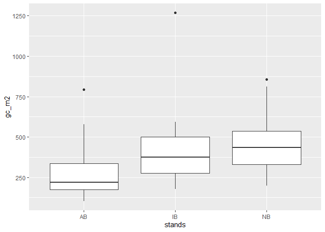
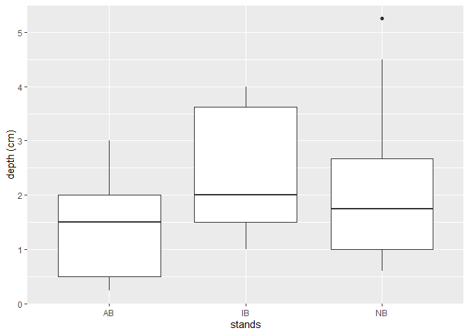

duff_CBC
================
Moeka
2023-10-23

``` r
duff_raw <- read_sheet("https://docs.google.com/spreadsheets/d/1NRI5QjxW5u2U0_qZSa3KIDL0LKlD78wXndwjfijug2w/edit#gid=211494136")
```

    ## ! Using an auto-discovered, cached token.

    ##   To suppress this message, modify your code or options to clearly consent to
    ##   the use of a cached token.

    ##   See gargle's "Non-interactive auth" vignette for more details:

    ##   <https://gargle.r-lib.org/articles/non-interactive-auth.html>

    ## ℹ The googlesheets4 package is using a cached token for 'mono@tamu.edu'.

    ## Auto-refreshing stale OAuth token.

    ## ✔ Reading from "Duff layer".

    ## ✔ Range 'duff'.

    ## New names:
    ## • `` -> `...15`
    ## • `` -> `...16`
    ## • `` -> `...17`
    ## • `` -> `...18`
    ## • `` -> `...19`
    ## • `` -> `...20`
    ## • `` -> `...21`
    ## • `` -> `...22`
    ## • `` -> `...23`

``` r
duff <- duff_raw[,c(1:13)]


duff <- 
  duff %>%
  mutate(gc_m2 = total*0.5/(.33*.34))

ggplot(duff)+geom_boxplot(aes(stands, gc_m2))
```

<!-- -->

``` r
duff %>% 
  group_by(stands) %>% 
  summarize(st_mean = mean(gc_m2), sd = sd(gc_m2))
```

    ## # A tibble: 3 × 3
    ##   stands st_mean    sd
    ##   <chr>    <dbl> <dbl>
    ## 1 AB        297.  202.
    ## 2 IB        441.  292.
    ## 3 NB        476.  206.

``` r
ggplot(duff)+geom_boxplot(aes(stands, depth)) + ylab("depth (cm)")
```

<!-- -->

``` r
duff %>% 
  group_by(stands) %>% 
  summarize(st_mean = mean(depth), sd = sd(depth))
```

    ## # A tibble: 3 × 3
    ##   stands st_mean    sd
    ##   <chr>    <dbl> <dbl>
    ## 1 AB        1.35 0.876
    ## 2 IB        2.44 1.15 
    ## 3 NB        2.17 1.47
