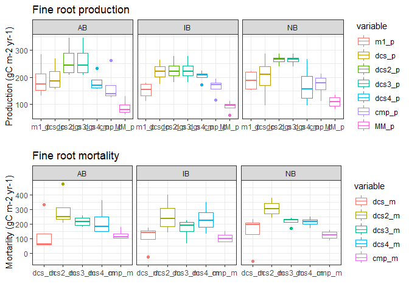

Root_graph_v3
================
Moeka
2022-03-11

``` r
root_raw <- 
  read_sheet("https://docs.google.com/spreadsheets/d/1aA9hV6hD3Ud6ArRN7Ytk0jgVU1x-cPDYuzXm7T4omdw/edit",
             col_types = "cccTnnnnnnnncccnnnnnnnn")
```

    ## ! Using an auto-discovered, cached token.

    ##   To suppress this message, modify your code or options to clearly consent to
    ##   the use of a cached token.

    ##   See gargle's "Non-interactive auth" vignette for more details:

    ##   <https://gargle.r-lib.org/articles/non-interactive-auth.html>

    ## ℹ The googlesheets4 package is using a cached token for 'mono@tamu.edu'.

    ## ✔ Reading from "RootData".

    ## ✔ Range 'Sheet1'.

    ## Warning in .Primitive("as.double")(x, ...): NAs introduced by coercion

    ## Warning in .Primitive("as.double")(x, ...): NAs introduced by coercion

    ## Warning in .Primitive("as.double")(x, ...): NAs introduced by coercion

    ## Warning in .Primitive("as.double")(x, ...): NAs introduced by coercion

    ## Warning in .Primitive("as.double")(x, ...): NAs introduced by coercion

    ## Warning in .Primitive("as.double")(x, ...): NAs introduced by coercion

    ## Warning in .Primitive("as.double")(x, ...): NAs introduced by coercion

    ## Warning in .Primitive("as.double")(x, ...): NAs introduced by coercion

    ## Warning in .Primitive("as.double")(x, ...): NAs introduced by coercion

    ## Warning in .Primitive("as.double")(x, ...): NAs introduced by coercion

    ## Warning in .Primitive("as.double")(x, ...): NAs introduced by coercion

    ## Warning in .Primitive("as.double")(x, ...): NAs introduced by coercion

    ## Warning in .Primitive("as.double")(x, ...): NAs introduced by coercion

    ## Warning in .Primitive("as.double")(x, ...): NAs introduced by coercion

    ## Warning in .Primitive("as.double")(x, ...): NAs introduced by coercion

    ## Warning in .Primitive("as.double")(x, ...): NAs introduced by coercion

    ## Warning in .Primitive("as.double")(x, ...): NAs introduced by coercion

    ## Warning in .Primitive("as.double")(x, ...): NAs introduced by coercion

    ## Warning in .Primitive("as.double")(x, ...): NAs introduced by coercion

    ## Warning in .Primitive("as.double")(x, ...): NAs introduced by coercion

    ## Warning in .Primitive("as.double")(x, ...): NAs introduced by coercion

    ## Warning in .Primitive("as.double")(x, ...): NAs introduced by coercion

    ## Warning in .Primitive("as.double")(x, ...): NAs introduced by coercion

    ## Warning in .Primitive("as.double")(x, ...): NAs introduced by coercion

    ## Warning in .Primitive("as.double")(x, ...): NAs introduced by coercion

    ## Warning in .Primitive("as.double")(x, ...): NAs introduced by coercion

    ## Warning in .Primitive("as.double")(x, ...): NAs introduced by coercion

``` r
colnames(root_raw) <- 
  c("Stands", "Plot", "Collar", "Date", 
    "DF", "LF", "DC", "LC", 
    "mass", "DB", "LB", "Charcoal",
    "Author", "Notes", "Method", 
    "DF_reweigh", "LF_reweigh", "DC_reweigh", "LC_reweigh",
    "Charcoal_reweigh", "Bark", "LB_reweigh", "DB_reweigh")

root_raw <- mutate(root_raw, ID = row_number()) # Just for removing rows later

root_raw$MY<-NA
root_raw$MY[root_raw$Date > "2020-07-05" & root_raw$Date < "2020-07-22"] = "Jul20"
root_raw$MY[root_raw$Date > "2020-07-27" & root_raw$Date < "2020-08-15"] = "Aug20"
root_raw$MY[root_raw$Date > "2020-09-01" & root_raw$Date < "2020-09-12"] = "Sep20"
root_raw$MY[root_raw$Date > "2020-09-29" & root_raw$Date < "2020-10-17"] = "Oct20"
root_raw$MY[root_raw$Date > "2020-10-29" & root_raw$Date < "2020-11-19"] = "Nov20"
root_raw$MY[root_raw$Date > "2020-12-01" & root_raw$Date < "2020-12-30"] = "Dec20"
root_raw$MY[root_raw$Date > "2021-01-05" & root_raw$Date < "2021-01-16"] = "Jan21"
root_raw$MY[root_raw$Date > "2021-02-01" & root_raw$Date < "2021-02-13"] = "Feb21"
root_raw$MY[root_raw$Date > "2021-03-04" & root_raw$Date < "2021-03-20"] = "Mar21"
root_raw$MY[root_raw$Date > "2021-04-08" & root_raw$Date < "2021-04-28"] = "Apr21"
root_raw$MY[root_raw$Date > "2021-05-09" & root_raw$Date < "2021-05-28"] = "May21"
root_raw$MY[root_raw$Date > "2021-06-09" & root_raw$Date < "2021-07-08"] = "Jun21"
root_raw$MY[root_raw$Date > "2021-07-14" & root_raw$Date < "2021-08-03"] = "Jul21"
root_raw$MY[root_raw$Date > "2021-08-24" & root_raw$Date < "2021-09-21"] = "Aug21"
root_raw$MY[root_raw$Date > "2021-09-26" & root_raw$Date < "2021-10-19"] = "Sep21"

for (i in 1:nrow(root_raw)){
  if(is.na(root_raw$DF_reweigh[i])=="FALSE"){root_raw$DF[i]<-root_raw$DF_reweigh[i]}  
}

for (i in 1:nrow(root_raw)){
  if(is.na(root_raw$LF_reweigh[i])=="FALSE"){root_raw$LF[i]<-root_raw$LF_reweigh[i]}  
}


# Biomass to gC/m2
area <- (5.2*0.01/2)^2 * pi # area (m2)

root_raw <- 
  root_raw %>%
  mutate(DF_gC = DF*0.5/area,   # DF_gC (gC/m2)
         LF_gC = LF*0.5/area)   # LF_gC (gC/m2)


### Remove NAs ###

# check what will be removed
subset(root_raw, grepl("Remove", Notes))# %>% select(Notes)
```

    ## # A tibble: 5 × 27
    ##   Stands Plot  Collar Date                    DF      LF       DC     LC  mass
    ##   <chr>  <chr> <chr>  <dttm>               <dbl>   <dbl>    <dbl>  <dbl> <dbl>
    ## 1 NB     1     3      2020-12-18 00:00:00  0.489  0.495  NA       NA      808.
    ## 2 NB     4     9      2020-12-18 00:00:00 NA     NA      NA       NA      858.
    ## 3 NB     4     3      2021-02-12 00:00:00  0.507  0.248   0.372    0.332  862.
    ## 4 IB     4     7      2021-05-17 00:00:00 NA     NA      NA       NA       NA 
    ## 5 NB     4     3      2021-05-16 00:00:00  0.110  0.0636  0.00995  1.12   834.
    ## # ℹ 18 more variables: DB <dbl>, LB <dbl>, Charcoal <dbl>, Author <chr>,
    ## #   Notes <chr>, Method <chr>, DF_reweigh <dbl>, LF_reweigh <dbl>,
    ## #   DC_reweigh <dbl>, LC_reweigh <dbl>, Charcoal_reweigh <dbl>, Bark <dbl>,
    ## #   LB_reweigh <dbl>, DB_reweigh <dbl>, ID <int>, MY <chr>, DF_gC <dbl>,
    ## #   LF_gC <dbl>

``` r
# removed the problem data & samples out of the observation term
# but includes samples not yet weighed
root1 <- 
  subset(root_raw, !grepl("Remove", Notes)) %>% # Remove
  filter(!is.na(MY)) # remove NAs out of sampling terms - mostly March 2020


### Working dataframe ###
root <- 
  root1[!is.na(root1$DF_gC) & !is.na(root1$LF_gC),] %>% # remove samples still in the oven
  select(c("Stands", "Plot", "Collar", "Date", "MY", "DF_gC", "LF_gC" ))
any(is.na(root))
```

    ## [1] FALSE

``` r
MY_order <- c("Jul20","Aug20","Sep20","Oct20", "Nov20", "Dec20", "Jan21",
                       "Feb21","Mar21","Apr21","May21","Jun21","Jul21","Aug21","Sep21")

root_plmean<- root %>%
    group_by(Stands,Plot,MY) %>%
    summarise(across(c(DF_gC,LF_gC), 
                     list(mean=mean, sd = sd,n = ~n()))) %>% 
    arrange(match(MY,MY_order)) %>%
    arrange(Stands,Plot) 
```

    ## `summarise()` has grouped output by 'Stands', 'Plot'. You can override using
    ## the `.groups` argument.

# labeling error

ABP1 in June 21 has 10 samples and no samples in ABP2 ABP2 in Feb 21 has
10 samples and no samples in ABP1

Use the 10 sample average for both plots for these 2 months

``` r
temp_imp <- 
  root_plmean %>% filter(DF_gC_n == 10) %>%
  left_join(
    data.frame(Stands = rep("AB",2), Plot = c("1","2"), MY = c("Feb21","Jun21")), by = c("Stands","MY")
  ) %>%
  select(-Plot.x) %>%
  rename(Plot = Plot.y) %>%
  mutate(DF_gC_n = 0, LF_gC_n = 0)

root_plmean_imp <- 
  rbind(root_plmean, temp_imp) %>%
  arrange(match(MY,MY_order)) %>%
  arrange(Stands,Plot) 
```

\##\`\`\`{r Imputation with regression} \##root_plmean1 \<- data.frame(
\## Stands = rep(c(“AB”, “IB”,“NB”),each = 60), \## Plot =
rep(as.character(1:4),each=15, times=3), \## MY = rep(MY,12) \##)

\##root_plmean2 \<- left_join(root_plmean1, root_plmean, key = c(Stands,
Plot, MY))

\##root_plmean2$DF_gC_n[is.na(root_plmean2$DF_gC_n)\]\<-0
\##root_plmean2$LF_gC_n[is.na(root_plmean2$LF_gC_n)\]\<-0

``` r
p_lf <- ggplot(root_plmean_imp) + 
  geom_boxplot(aes(x=factor(MY, level = MY_order), LF_gC_mean)) + 
  facet_wrap(~Stands) + theme_bw() + xlab("") +
  ggtitle("changes in live fine (gC/m2)")

# temporal changes in DF
p_df <- ggplot(root_plmean_imp) + 
  geom_boxplot(aes(x=factor(MY, level = MY_order), DF_gC_mean)) + 
  facet_wrap(~Stands) + theme_bw() + xlab("") +
  ggtitle("changes in dead fine (gC/m2)")

grid.arrange(p_lf,p_df, nrow = 2)
```

<!-- -->

### Root production and mortality estimation

To get a final annual estimation for production, get an average value
from methods 1, 2, and 4. Regarding a mortality estimation, the
compartment flow method (Method 3) was used since the decomposition rate
is taken into consideration.

### Method 1 (P: Harris 1977,; M: Joslin 1987 ??).

P = the sum of the LF increments

### Method 2: Decision matrix (Gower 1992). (dcs\_)

## 3-month sample interval

## modified from MacClaugherty et al 1982 & Fairley and Alexander 1985

Four cases present: 1: LF increase, DF increase / P= L+D, M = D 2: LF
increase, DF decrease / P = L, M = L 3: LF decrease, DF increase / P =
L+D, M = D 4: LF decrease, DF decrease / P = 0, M = L

### Method 3: Compartment flow method (Santantonio 1987).

M(i) = D(i+1)-D(i) + kd1 P = L(i+1) + M(i)  
Assuming the decomposition rate is constant. k = the decomposition rate
(0.6/yr, 0.05/mo), d1 = Dead Fine Root biomass at the previous month if
the M \< 0, set as 0

### Method 4: Decision matrix by Assefa 2017 & Brunner 2011. (dcs2\_)

### Method 5: Decision matrix by Yuan 2013. (dcs3\_)

### Method 6: Decision matrix McClaugherty et al 1982. (dcs4\_)

### Method 7: Max-min McClaugherty et al 1982. (MM)

``` r
Month <- data.frame(MY = MY_order, M = c(1:15))

root_diff <- 
  left_join(root_plmean_imp, Month, by = "MY") %>%
  mutate(LF_diff = ifelse(MY == "Jul20", NA, LF_gC_mean - lag(LF_gC_mean))) %>%
  mutate(DF_diff = ifelse(MY == "Jul20", NA, DF_gC_mean - lag(DF_gC_mean))) %>%
  mutate(MY_diff = ifelse(MY == "Jul20", NA, M - lag(M)))


#root_diff <- root_diff1 %>% select(c("MY","Stands","Plot","LF_diff","DF_diff","MY_diff"))


root_estimation <- function(df){
  df <- df %>% 
         mutate(m1_p = ifelse(LF_diff > 0, LF_diff, 0),
         ############################################
         dcs_p = case_when(DF_diff > 0 ~ LF_diff + DF_diff,
                           DF_diff < 0 ~ 
                              ifelse(LF_diff > 0, LF_diff, 0)),
         dcs_m = case_when(DF_diff > 0 ~ DF_diff,
                           DF_diff < 0 ~ LF_diff),
         #############################################
         dcs2_p = case_when(DF_diff > 0 ~
                              ifelse(LF_diff + DF_diff > 0,
                                     LF_diff + DF_diff, 0),
                            DF_diff < 0 ~ 
                              ifelse(LF_diff > 0, LF_diff, 0)),
         dcs2_m = case_when(DF_diff > 0 ~ 
                              ifelse(LF_diff + DF_diff > 0,
                                     DF_diff, abs(LF_diff)),
                            DF_diff < 0 ~ abs(LF_diff)),
         dcs2_d = case_when(DF_diff > 0 & LF_diff > 0 ~ 0,
                            DF_diff > 0 & LF_diff < 0 ~
                              ifelse(abs(LF_diff) > DF_diff,
                                     abs(LF_diff) - DF_diff, 0),
                            DF_diff < 0 & LF_diff > 0 ~ abs(DF_diff),
                            DF_diff < 0 & LF_diff < 0 ~ abs(DF_diff) + abs(LF_diff)),
         #####################################################
         dcs3_p = case_when(DF_diff > 0 ~
                              ifelse(LF_diff + DF_diff > 0,
                                     LF_diff + DF_diff, 0),
                            DF_diff < 0 ~ 
                              ifelse(LF_diff > 0, LF_diff, 0)),
         dcs3_m = case_when(DF_diff > 0 ~ 
                              ifelse(LF_diff + DF_diff > 0,
                                     DF_diff, abs(LF_diff)),
                            DF_diff < 0 ~ 
                              ifelse(LF_diff > 0,
                                     0, abs(LF_diff))),
         dcs3_d = case_when(DF_diff > 0 ~
                              ifelse(LF_diff + DF_diff > 0,
                                     0, abs(LF_diff + DF_diff)),
                            DF_diff < 0 & LF_diff > 0 ~ abs(DF_diff),
                            DF_diff < 0 & LF_diff < 0 ~ abs(DF_diff + LF_diff)),
        #######################################################################
         dcs4_p = case_when(DF_diff > 0 & LF_diff > 0 ~ LF_diff + DF_diff,
                            DF_diff > 0 & LF_diff < 0 ~ pmin(LF_diff + DF_diff, 0), # pmin is for multiple vectors
                            DF_diff < 0 ~ 
                              ifelse(LF_diff > 0, LF_diff, 0)),
         dcs4_m = case_when(DF_diff > 0 & LF_diff > 0 ~ DF_diff,
                            DF_diff > 0 & LF_diff < 0 ~ pmin(DF_diff, abs(LF_diff)),
                            DF_diff < 0 ~ abs(LF_diff)),
         dcs4_d = case_when(DF_diff > 0 & LF_diff > 0 ~ 0,
                            DF_diff > 0 & LF_diff < 0 ~ pmin(abs(LF_diff-DF_diff), 0),
                            DF_diff < 0 & LF_diff > 0 ~ abs(DF_diff),
                            DF_diff < 0 & LF_diff < 0 ~ abs(DF_diff) + abs(LF_diff)),
         #####################################################
         cmp_m_temp = DF_diff + 0.06*MY_diff*lag(DF_gC_mean)) %>%
    mutate(cmp_m = ifelse(cmp_m_temp < 0, 0, cmp_m_temp)) %>%
    mutate(cmp_p = LF_diff + cmp_m)

  return(df)
}

root_est <- 
  root_estimation(root_diff) 
```

``` r
p_prd <- root_est %>%
  select(c(1:3,ends_with("_p"))) %>%
  filter(!MY == "Jul20") %>%
  data.table::melt(id = c(1:3)) %>% 
  ggplot() + geom_boxplot(aes(x=factor(MY, level = MY_order), value, 
                              group = interaction(MY, variable), col = variable)) + 
  ylab("Production (gC/m2)") + ggtitle("Fine root production") + xlab("")+
  theme_bw() + 
  facet_wrap(~Stands)
```

    ## Warning in data.table::melt(., id = c(1:3)): The melt generic in data.table has
    ## been passed a grouped_df and will attempt to redirect to the relevant reshape2
    ## method; please note that reshape2 is deprecated, and this redirection is now
    ## deprecated as well. To continue using melt methods from reshape2 while both
    ## libraries are attached, e.g. melt.list, you can prepend the namespace like
    ## reshape2::melt(.). In the next version, this warning will become an error.

``` r
p_mrt<- root_est %>%
  select(c(1:3,ends_with("_m"))) %>%
  filter(!MY == "Jul20") %>%
  data.table::melt(id = c(1:3)) %>% 
  ggplot() + geom_boxplot(aes(x=factor(MY, level = MY_order), value, 
                              group = interaction(MY, variable), col = variable)) + 
  ylab("Mortality (gC/m2)") + ggtitle("Fine root mortality") + xlab("")+ 
  theme_bw() + 
  facet_wrap(~Stands)
```

    ## Warning in data.table::melt(., id = c(1:3)): The melt generic in data.table has
    ## been passed a grouped_df and will attempt to redirect to the relevant reshape2
    ## method; please note that reshape2 is deprecated, and this redirection is now
    ## deprecated as well. To continue using melt methods from reshape2 while both
    ## libraries are attached, e.g. melt.list, you can prepend the namespace like
    ## reshape2::melt(.). In the next version, this warning will become an error.

``` r
p_dcm <- root_est %>%
  select(c(1:3,ends_with("_d"))) %>%
  filter(!MY == "Jul20") %>%
  data.table::melt(id = c(1:3)) %>% 
  ggplot() + geom_boxplot(aes(x=factor(MY, level = MY_order), value, 
                              group = interaction(MY, variable), col = variable)) + 
  ylab("Decomposition (gC/m2)") + ggtitle("Fine root decomposition") + xlab("")+ 
  theme_bw() + 
  facet_wrap(~Stands)
```

    ## Warning in data.table::melt(., id = c(1:3)): The melt generic in data.table has
    ## been passed a grouped_df and will attempt to redirect to the relevant reshape2
    ## method; please note that reshape2 is deprecated, and this redirection is now
    ## deprecated as well. To continue using melt methods from reshape2 while both
    ## libraries are attached, e.g. melt.list, you can prepend the namespace like
    ## reshape2::melt(.). In the next version, this warning will become an error.

``` r
grid.arrange(p_prd,p_mrt, p_dcm, ncol = 1)
```

<!-- -->

``` r
# Sep 01, 2020 - Aug 31, 2021
root_monthly_cum <- 
  root_est %>%
  filter(!MY %in% c("Jul20","Aug20", "Sep20")) %>%
  mutate(across(m1_p:cmp_p, cumsum)) 


# for Max-Min
root_MM <-
  root_monthly_cum %>% 
  group_by(Stands, Plot) %>% 
  summarise(MM_p = max(LF_gC_mean) - min(LF_gC_mean),
            Bmax = max(LF_gC_mean),
            Bmean = mean(LF_gC_mean))
```

    ## `summarise()` has grouped output by 'Stands'. You can override using the
    ## `.groups` argument.

``` r
# quick result
root_sum <-
  root_monthly_cum %>% 
  filter(MY == "Sep21") %>% 
  select(c(1:2,m1_p:cmp_p)) %>%
  left_join(root_MM, by = c("Stands", "Plot"))

knitr::kable(root_sum, format = "simple")
```

| Stands | Plot |     m1_p |     dcs_p |     dcs_m |   dcs2_p |   dcs2_m |    dcs2_d |   dcs3_p |    dcs3_m |    dcs3_d |    dcs4_p |   dcs4_m |    dcs4_d | cmp_m\_temp |     cmp_m |    cmp_p |      MM_p |      Bmax |     Bmean |
|:-------|:-----|---------:|----------:|----------:|---------:|---------:|----------:|---------:|----------:|----------:|----------:|---------:|----------:|------------:|----------:|---------:|----------:|----------:|----------:|
| AB     | 1    | 283.5517 | 267.84823 | 331.96225 | 344.5934 | 472.8827 | 267.23940 | 344.5934 | 258.31024 | 267.23940 | 232.45557 | 360.7448 | 190.49422 |    42.71095 | 175.21527 | 261.4984 | 131.02407 | 184.35039 | 104.01064 |
| AB     | 2    | 190.2232 | 156.37075 |  63.49474 | 268.9093 | 256.7216 | 218.24428 | 268.9093 | 235.42940 | 218.24428 | 156.37075 | 144.1830 | 105.70572 |    57.69294 | 101.84491 | 135.3248 |  87.99094 | 126.82224 |  77.00861 |
| AB     | 3    | 159.0313 | 166.31197 |  57.00196 | 219.1447 | 204.9189 | 163.03211 | 219.1447 | 194.37669 | 163.03211 | 163.91664 | 149.6909 | 110.19942 |    63.34570 | 115.74661 | 140.5146 |  61.85288 |  92.92436 |  64.43971 |
| AB     | 4    | 131.3815 | 207.47978 |  53.14351 | 207.4798 | 242.3590 | 158.85924 | 207.4798 | 179.35667 | 158.85924 | 175.33978 | 210.2190 | 158.85924 |    52.13804 |  96.75601 | 124.8791 |  74.02918 | 108.62607 |  64.96076 |
| IB     | 1    | 179.1883 | 263.53740 | 173.04604 | 277.3672 | 399.5143 | 254.59890 | 277.3672 | 221.79301 | 254.59890 | 224.41589 | 346.5631 | 240.76913 |    17.32058 | 115.80442 | 171.3786 |  97.22154 | 124.96488 |  63.92365 |
| IB     | 2    | 111.0747 | 231.26725 | 146.68216 | 231.2672 | 276.9401 | 183.26037 | 231.2672 | 205.44471 | 183.26037 | 209.58564 | 255.2585 | 183.26037 |    57.02061 | 147.45704 | 173.2796 |  61.49231 | 100.13624 |  58.15857 |
| IB     | 3    | 172.3594 | 210.83098 | -26.51554 | 214.5194 | 197.2680 | 153.00605 | 214.5194 | 173.18954 | 153.00605 | 209.04919 | 191.7977 | 149.31759 |    49.21185 |  75.19647 | 116.5264 |  97.97388 | 140.39538 |  67.91049 |
| IB     | 4    | 138.6649 | 173.90620 | 132.16617 | 181.8807 | 140.1406 |  35.40868 | 181.8807 |  65.80445 |  35.40868 | 172.72290 | 130.9829 |  27.43422 |    57.85659 |  79.24010 | 195.3163 | 112.78105 | 135.66782 |  65.59067 |
| NB     | 1    | 157.4857 | 194.08180 | 230.66955 | 239.5327 | 276.7608 | 170.87237 | 239.5327 | 169.30390 | 170.87237 | 131.08399 | 168.3121 | 125.42151 |    47.81349 | 142.66532 | 212.8941 |  84.08184 | 120.37152 |  84.72139 |
| NB     | 2    | 218.4437 | 285.62874 | -54.77331 | 285.6287 | 239.9607 | 225.24545 | 285.6287 | 224.52972 | 225.24545 | 265.46244 | 219.7944 | 225.24545 |    53.39068 | 106.21824 | 167.3173 | 123.37475 | 157.78517 |  92.96103 |
| NB     | 3    | 151.6595 | 225.47031 | 185.71053 | 263.8216 | 328.7653 | 253.04991 | 263.8216 | 226.27703 | 253.04991 | 182.06890 | 247.0126 | 214.69863 |    29.86197 | 154.44190 | 191.9865 |  96.84107 | 146.60948 |  85.79461 |
| NB     | 4    | 221.4612 |  96.38633 | 198.83420 | 267.1907 | 378.3869 | 259.28989 | 267.1907 | 240.87406 | 259.28989 |  96.38633 | 207.5825 |  88.48556 |    25.48406 |  86.93467 | 113.2513 | 134.64520 | 149.06038 |  67.23557 |

``` r
# viz for production
p_prd_yr <-   
  root_sum %>% 
  select(c(1:2,ends_with("_p"))) %>%
  data.table::melt(id = c(1:2)) %>% 
  ggplot() + geom_boxplot(aes(variable, value, col = variable)) +
  theme_bw() + ylab("Production (gC m-2 yr-1)") + 
  ggtitle("Fine root production") + xlab("")+ 
  facet_wrap(~Stands)
```

    ## Warning in data.table::melt(., id = c(1:2)): The melt generic in data.table has
    ## been passed a grouped_df and will attempt to redirect to the relevant reshape2
    ## method; please note that reshape2 is deprecated, and this redirection is now
    ## deprecated as well. To continue using melt methods from reshape2 while both
    ## libraries are attached, e.g. melt.list, you can prepend the namespace like
    ## reshape2::melt(.). In the next version, this warning will become an error.

``` r
# viz for mortality
p_mrt_yr <-   
  root_sum %>% 
  select(c(1:2,ends_with("_m"))) %>%
  data.table::melt(id = c(1:2)) %>% 
  ggplot() + geom_boxplot(aes(variable, value, col = variable)) +
  theme_bw() + ylab("Mortarlity (gC m-2 yr-1)") + 
  ggtitle("Fine root mortality") + xlab("")+
  facet_wrap(~Stands)
```

    ## Warning in data.table::melt(., id = c(1:2)): The melt generic in data.table has
    ## been passed a grouped_df and will attempt to redirect to the relevant reshape2
    ## method; please note that reshape2 is deprecated, and this redirection is now
    ## deprecated as well. To continue using melt methods from reshape2 while both
    ## libraries are attached, e.g. melt.list, you can prepend the namespace like
    ## reshape2::melt(.). In the next version, this warning will become an error.

``` r
grid.arrange(p_prd_yr,p_mrt_yr, ncol = 1)
```

<!-- -->

``` r
root_turnover <- 
  root_sum %>%
  select(c(1:2, ends_with("_p"), 19:20)) %>%
  mutate_at(vars(m1_p:MM_p), 
            list(Bmax = ~./ Bmax,
                 Bmean = ~./Bmean))

# custom x-axis labels 
x_axis_labels <- colnames(root_turnover)[c(3:9)]

# turnover rates = annual production/Bmax
p_turnover_max <-   
  root_turnover %>%
  select(c(1:2,ends_with("_Bmax"))) %>%
  data.table::melt(id = c(1:2)) %>% 
  ggplot() + geom_boxplot(aes(variable, value, col = variable)) +
  theme_bw() + ggtitle("Turnover rates (yr-1) with LFmax") + 
  ylab("Turnover (yr-1)") + xlab("")+
  facet_wrap(~Stands) + 
  scale_x_discrete(labels= x_axis_labels) +
  scale_colour_hue(labels = x_axis_labels)
```

    ## Warning in data.table::melt(., id = c(1:2)): The melt generic in data.table has
    ## been passed a grouped_df and will attempt to redirect to the relevant reshape2
    ## method; please note that reshape2 is deprecated, and this redirection is now
    ## deprecated as well. To continue using melt methods from reshape2 while both
    ## libraries are attached, e.g. melt.list, you can prepend the namespace like
    ## reshape2::melt(.). In the next version, this warning will become an error.

``` r
# turnover rates = annual production/Bmean
p_turnover_mean <-
  root_turnover %>%
  select(c(1:2,ends_with("_Bmean"))) %>%
  data.table::melt(id = c(1:2)) %>% 
  ggplot() + geom_boxplot(aes(variable, value, col = variable)) +
  theme_bw() + ggtitle("Turnover rates (yr-1) with LFmean") + 
  ylab("Turnover (yr-1)") + xlab("")+ 
  facet_wrap(~Stands)+ 
  scale_x_discrete(labels= x_axis_labels) +
  scale_colour_hue(labels = x_axis_labels)
```

    ## Warning in data.table::melt(., id = c(1:2)): The melt generic in data.table has
    ## been passed a grouped_df and will attempt to redirect to the relevant reshape2
    ## method; please note that reshape2 is deprecated, and this redirection is now
    ## deprecated as well. To continue using melt methods from reshape2 while both
    ## libraries are attached, e.g. melt.list, you can prepend the namespace like
    ## reshape2::melt(.). In the next version, this warning will become an error.

``` r
grid.arrange(p_turnover_max, p_turnover_mean, ncol = 1)
```

<!-- -->

Test 2-month sampling interval to see whether it looks differ from
monthly sampling interval.

(Sep20), Oct20, Dec20, Feb21, Apr21, Jun21, Aug21, Sep21

``` r
root_diff_test <- 
  left_join(root_plmean_imp, Month, by = "MY") %>%
  filter(M %in% c("3","4","6","8","10","12","14","15")) %>%
  mutate(LF_diff = ifelse(MY == "Jul20", NA, LF_gC_mean - lag(LF_gC_mean))) %>%
  mutate(DF_diff = ifelse(MY == "Jul20", NA, DF_gC_mean - lag(DF_gC_mean))) %>%
  mutate(MY_diff = ifelse(MY == "Jul20", NA, M - lag(M)))

# applying 6 methods above
root_est_test <- 
  root_estimation(root_diff_test) 
  

root_bimonthly_cum_test <- 
  root_est_test %>%
  filter(!MY == "Sep20") %>% # does not work with NAs
  mutate(across(m1_p:cmp_p, cumsum)) 


# for Max-Min
root_MM_bimonthly <-
  root_bimonthly_cum_test %>% 
  group_by(Stands, Plot) %>% 
  summarise(MM_p = max(LF_gC_mean) - min(LF_gC_mean),
            Bmax = max(LF_gC_mean),
            Bmean = mean(LF_gC_mean))
```

    ## `summarise()` has grouped output by 'Stands'. You can override using the
    ## `.groups` argument.

``` r
# quick result
root_sum_bimonthly <-
  root_bimonthly_cum_test %>% 
  filter(MY == "Sep21") %>% 
  select(c(1:2,m1_p:cmp_p)) %>%
  left_join(root_MM_bimonthly, by = c("Stands", "Plot"))


# viz for production
p_prd_test <-
  root_sum_bimonthly %>% 
  select(c(1:2,ends_with("_p"))) %>%
  data.table::melt(id = c(1:2)) %>% 
  ggplot() + geom_boxplot(aes(variable, value, col = variable)) +
  theme_bw() + ylab("Production (gC m-2 yr-1)") + 
  ggtitle("Fine root production") + xlab("")+ 
  facet_wrap(~Stands)
```

    ## Warning in data.table::melt(., id = c(1:2)): The melt generic in data.table has
    ## been passed a grouped_df and will attempt to redirect to the relevant reshape2
    ## method; please note that reshape2 is deprecated, and this redirection is now
    ## deprecated as well. To continue using melt methods from reshape2 while both
    ## libraries are attached, e.g. melt.list, you can prepend the namespace like
    ## reshape2::melt(.). In the next version, this warning will become an error.

``` r
# viz for mortality
p_mrt_test <-
  root_sum_bimonthly %>% 
  select(c(1:2,ends_with("_m"))) %>%
  data.table::melt(id = c(1:2)) %>% 
  ggplot() + geom_boxplot(aes(variable, value, col = variable)) +
  theme_bw() + ylab("Mortality (gC m-2 yr-1)") + 
  ggtitle("Fine root mortality") + xlab("")+ 
  facet_wrap(~Stands)
```

    ## Warning in data.table::melt(., id = c(1:2)): The melt generic in data.table has
    ## been passed a grouped_df and will attempt to redirect to the relevant reshape2
    ## method; please note that reshape2 is deprecated, and this redirection is now
    ## deprecated as well. To continue using melt methods from reshape2 while both
    ## libraries are attached, e.g. melt.list, you can prepend the namespace like
    ## reshape2::melt(.). In the next version, this warning will become an error.

``` r
grid.arrange(p_prd_test, p_mrt_test, ncol = 1)
```

<!-- -->

``` r
knitr::opts_chunk$set(eval = FALSE)
library(nlme)
root_diff <- root_diff %>% 
  mutate(Prod = ifelse(is.na(m1_p) == TRUE, NA, (m1_p + m2_p + m4_p)/3))

root_diff_pl <- root_diff %>%
  filter(!MY %in% c("Jul20","Aug20","Sep21")) %>%
  group_by(Stands,Plot) %>%
  summarise_at(vars(m1_p:Prod),sum)

root_diff_pl <- root_diff_pl[,-c(5:6)]

colnames(root_diff_pl) <- 
  c("Stands","Plot","Prod_m1","Prod_m2","Mor_m3","Prod_m4","Mor_m4","Prod")


mor3_anova <- aov(Mor_m3~Stands + Error(Plot),data = root_diff_pl)
mor4_anova <- aov(Mor_m4~Stands + Error(Plot),data = root_diff_pl)
summary(mor3_anova)
summary(mor4_anova)

library(emmeans)
emmeans(mor3_anova, list(pairwise ~ Stands), adjust = "tukey")
emmeans(mor4_anova, list(pairwise ~ Stands), adjust = "tukey")
```

``` r
knitr::opts_chunk$set(eval = FALSE)
library(pwr)
library(broom)
#tidy(rh_anova)
SS_tre_m3 = tidy(mor3_anova)$sumsq[2]
SS_tre_m4 = tidy(mor4_anova)$sumsq[2]
SS_res_m3 = tidy(mor3_anova)$sumsq[3]
SS_res_m4 = tidy(mor4_anova)$sumsq[3]

EtaSQ_m3 = SS_tre_m3/sum(SS_res_m3+SS_tre_m3)
EtaSQ_m4 = SS_tre_m4/sum(SS_res_m4+SS_tre_m4)

f_m3 = sqrt(EtaSQ_m3)/(1-EtaSQ_m3)
f_m4 = sqrt(EtaSQ_m4)/(1-EtaSQ_m4)

pwr.anova.test(k=3,n=4,f=f_m3,sig.level = 0.05)
pwr.anova.test(k=3,n=4,f=f_m4,sig.level = 0.05)

pwr.anova.test(k=3,power = 0.8,f=f_m3,sig.level = 0.05)
pwr.anova.test(k=3,power = 0.8,f=f_m4,sig.level = 0.05)
```

``` r
knitr::opts_chunk$set(eval = FALSE)
library(ggpubr)
library(rstatix)

pwc_m3 <- root_diff_pl %>% as_tibble() %>%
  pairwise_t_test(Mor_m3 ~ Stands, paired = T,
  p.adjust.method = "bonferroni")
pwc_m3<-pwc_m3 %>% add_xy_position(x="Stands")

pwc_m4 <- root_diff_pl %>% as_tibble() %>%
  pairwise_t_test(Mor_m4 ~ Stands, paired = T,
  p.adjust.method = "bonferroni")
pwc_m4<-pwc_m4 %>% add_xy_position(x="Stands")

ggboxplot(root_diff_pl,x="Stands",y="Mor_m3",add="point")+stat_pvalue_manual(pwc_m3)
# ggboxplot(root_diff_pl,x="Stands",y="Mor_m4",add="point")+stat_pvalue_manual(pwc_m4)
```

``` r
knitr::opts_chunk$set(eval = FALSE)

basic_theme <- 
  theme(axis.title.x = element_blank(),axis.text.x = element_text(size = 35),
        axis.title.y = element_text(size = 30),axis.text.y = element_text(size = 35),
        title = element_text(size = 30),legend.position="none")

ggplot(root_diff_pl, aes(Stands, Prod, col = Stands))+geom_boxplot(lwd=1.5)+ xlab("")+ylab("")+
      ggtitle(expression("Fine Root Production (gC/m"^2~")")) + basic_theme

ggplot(root_diff_pl, aes(Stands, Mor, col = Stands))+geom_boxplot(lwd=1.5)+ xlab("")+ylab("")+
      ggtitle(expression("Fine Root Mortality (gC/m"^2~")")) + basic_theme

#grid.arrange(p1,p2,ncol = 2)

# Only for the result number

root_diff_st <- root_diff_pl %>%
  group_by(Stands) %>%
  summarise_at(vars(Prod_m1:Prod),list(mean,sd))

colnames(root_diff_st)<-
  c("Stand","Prod_m1","Prod_m2","Mor_m3","Prod_m4","Mor_m4","Prod",
    "Prod_m1_sd","Prod_m2_sd","Mor_m3_sd","Prod_m4_sd","Mor_m4_sd","Prod_sd")

root_diff_st_long <- root_diff_st %>%
  gather("Prod_m1","Prod_m2","Mor_m3","Prod_m4","Mor_m4","Prod",key=Method,value=gC)

root_diff_st_long <- root_diff_st_long %>%
  mutate(sd = ifelse(Method == "Prod_m1",Prod_m1_sd,
                     ifelse(Method == "Prod_m2", Prod_m2_sd,
                            ifelse(Method == "Mor_m3", Mor_m3_sd,
                                   ifelse(Method == "Prod_m4", Prod_m4_sd,
                                        ifelse(Method == "Mor_m4", Mor_m4_sd, Prod_sd)))))) %>%
  select(Stand, Method, gC, sd)
```

``` r
knitr::opts_chunk$set(eval = FALSE)

ggplot(root_diff_st_long,aes(stands,gC, col = Method)) +
    geom_point(size = 8, position=position_dodge(0.2))+
    geom_errorbar(aes(ymin=gC-sd,ymax=gC+sd), 
                  width=0.2,lwd = 1.5,position=position_dodge(0.2))+
    theme(axis.title.x = element_blank(),axis.text.x = element_text(size = 35),
          axis.title.y = element_text(size = 30),axis.text.y = element_text(size = 35),
          title = element_text(size = 30))
```

``` r
knitr::opts_chunk$set(eval = FALSE)

root_diff_st_mor <- root_diff_st %>%
  gather("Mor_m3","Mor_m4",key=Methods,value=mean)

root_diff_st_mor$sd <- NA
root_diff_st_mor$sd[1:3] <- root_diff_st_mor$Mor_m3_sd[1:3]
root_diff_st_mor$sd[4:6] <- root_diff_st_mor$Mor_m4_sd[4:6]
root_diff_st_mor <- root_diff_st_mor[,c(1,12:14)]

ggplot(root_diff_st_mor,aes(Stands,mean, col=Methods)) + 
  ggtitle(expression("Fine root mortality (gC/m"^2~")"))+
  geom_point(size = 8, position=position_dodge(0.2))+ ylab("")+
  geom_errorbar(aes(ymin=mean-sd,ymax=mean+sd), 
                width=0.2,lwd = 1.5,position=position_dodge(0.2))+
  theme(axis.title.x = element_blank(),axis.text.x = element_text(size = 35),
        axis.title.y = element_text(size = 30),axis.text.y = element_text(size = 35),
        title = element_text(size = 30),legend.position="none") + 
  scale_color_brewer(palette = "Dark2")
```
