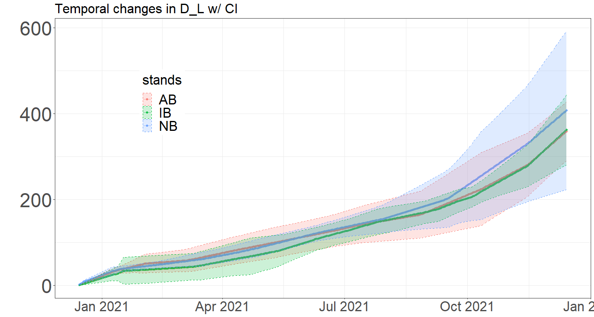

Litter_v3
================
Moeka
2023-07-21

# Data cleaning

``` r
sample_date <- read_sheet("https://docs.google.com/spreadsheets/d/1xtdzC74zT909AG4aZJP2djmnMWH_pSXezlNa-bfYZJE/edit#gid=0")
```

    ## ! Using an auto-discovered, cached token.

    ##   To suppress this message, modify your code or options to clearly consent to
    ##   the use of a cached token.

    ##   See gargle's "Non-interactive auth" vignette for more details:

    ##   <https://gargle.r-lib.org/articles/non-interactive-auth.html>

    ## ℹ The googlesheets4 package is using a cached token for 'mono@tamu.edu'.

    ## ✔ Reading from "Litter_sample_date".

    ## ✔ Range 'Sheet1'.

``` r
litter<- 
  read_sheet("https://docs.google.com/spreadsheets/d/1O8MfiH6v-F-Xfmy9caWivA6UjzFbfEtF2BA1lPlis-c/edit#gid=211494136",
              col_types = "cccDnnnnnnnnnnccc")
```

    ## ✔ Reading from "Litter".

    ## ✔ Range 'litter'.

    ## Warning in .Primitive("as.double")(x, ...): NAs introduced by coercion

    ## Warning in .Primitive("as.double")(x, ...): NAs introduced by coercion

``` r
litter <- litter %>% 
  mutate(ID = paste0(Stands, "P",Plot)) %>%
  mutate(tot_no_br = Total - Branch)


litter_n <- litter %>% 
  filter(!is.na(tot_no_br)) %>% # there is one NA
  group_by(ID, Date) %>% 
  summarise(mean_tot = mean(Total),
            mean_tot_no_br = mean(tot_no_br),
            n = n()) %>% 
  arrange(Date)
```

    ## `summarise()` has grouped output by 'ID'. You can override using the `.groups`
    ## argument.

Litter traps were installed on: 9/2/2020 at IB 9/4/2020 at AB 9/11/2020
at NB

``` r
# Making an empty dataframe
CBC_lit <- data.frame(Date = seq(as.Date("2020-09-02"), as.Date("2022-01-21"), by="days"))
Plot <- sort(unique(litter_n$ID))

for(i in 1:12){
 temp <- litter_n[litter_n$ID == Plot[i],-c(3,5)]

 # Setting up the beginning day
 if(substring(Plot[i], 1,1) == "A"){temp <- 
    rbind(data.frame(ID = Plot[i], 
                     Date = as.Date("2020-09-02"),
                     mean_tot_no_br = 0), temp)}
  else if(substring(Plot[i], 1,1) == "I"){temp <- 
    rbind(data.frame(ID = Plot[i], 
                     Date = as.Date("2020-09-04"),
                     mean_tot_no_br = 0), temp)}
  else{temp <- rbind(data.frame(ID = Plot[i], 
                                Date = as.Date("2020-09-11"),
                                mean_tot_no_br = 0), temp)}
 
 # Changing the column names 
  colnames(temp)[1] <- "ID"
  colnames(temp)[3] <- "Biomass" # TOTAL W/O BRANCH
 
   temp <- temp %>% 
    mutate(Days = as.numeric(Date-lag(Date))) %>%
    mutate(per_day_g = Biomass/Days) %>%
    mutate(per_day_g = ifelse(is.na(per_day_g), 0, per_day_g))
  
  #assign(paste("lit_", Plot[i],sep=''), temp)
  
  CBC_lit <- 
    left_join(CBC_lit, temp[, c("Date","per_day_g")], by = "Date")
  #CBC_lit <- merge(x = CBC_lit, y = temp[ , c("per_day_g")], by = "Date", all.x=TRUE)
  #CBC_lit$ID <- NULL
  colnames(CBC_lit)[colnames(CBC_lit) == "per_day_g"] <-  Plot[i]
}

# Creating the daily production on a plot level
CBC_lit_filled <- 
  CBC_lit %>% 
  fill(c(ABP1:NBP4), .direction="up") # filling gap upward
```

``` r
# non-full month in Sep21 and Jan 22

CBC_lit_mo <-
  CBC_lit_filled %>%
  mutate(month = lubridate::month(Date),
         year = lubridate::year(Date)) %>%
  mutate(MY = paste0(month.abb[month], substring(year,3,4))) %>%
  select(!Date) %>%
  gather(v, value, ABP1:NBP4) %>%
  group_by(MY, v) %>% 
  summarise(litter = sum(value)) %>%
  mutate(stands = substring(v,1,2),
         plot_num = as.character(substring(v,4,4)))
```

    ## `summarise()` has grouped output by 'MY'. You can override using the `.groups`
    ## argument.

``` r
CBC_lit_yr <- 
  CBC_lit_filled %>% 
  filter(Date >= "2020-12-15" & Date <= "2021-12-14") # Extracting the entire year

CBC_lit_yr_sum <- 
  CBC_lit_yr %>% 
  summarise(across(ABP1:NBP4, ~ sum(.x, na.rm = TRUE))) # Sum of the entire year per plot

CBC_lit_yr_sum_long <- 
  gather(CBC_lit_yr_sum, ID, Biomass_g, ABP1:NBP4, factor_key = T)

CBC_lit_yr_sum_long <- CBC_lit_yr_sum_long %>%
  mutate(gC_m2 = 0.5*Biomass_g/0.859) %>%
  mutate(Stand = substring(ID, 1,2))


CBC_lit_st <- 
  CBC_lit_yr_sum_long %>%
  group_by(Stand) %>%
  summarize_at("gC_m2",funs(mean, sd, se=sd(.)/2))
```

    ## Warning: `funs()` was deprecated in dplyr 0.8.0.
    ## ℹ Please use a list of either functions or lambdas:
    ## 
    ## # Simple named list: list(mean = mean, median = median)
    ## 
    ## # Auto named with `tibble::lst()`: tibble::lst(mean, median)
    ## 
    ## # Using lambdas list(~ mean(., trim = .2), ~ median(., na.rm = TRUE))
    ## Call `lifecycle::last_lifecycle_warnings()` to see where this warning was
    ## generated.

``` r
CI_lower <- function(avg_st, sd_st, n){
  lower <- avg_st - qt(1- 0.05/2, (n - 1))*sd_st/sqrt(n)
  }  
CI_upper <-function(avg_st, sd_st, n){
  upper <- avg_st + qt(1- 0.05/2, (n - 1))*sd_st/sqrt(n)
}


CBC_lit_cum_yr <- 
  CBC_lit_yr %>%
  mutate(across(ABP1:NBP4, ~cumsum(.x))) %>%
  mutate(AB_mean = rowSums(.[2:5])/4,
         IB_mean = rowSums(.[6:9])/4,
         NB_mean = rowSums(.[10:13]/4),
         AB_sd = apply(.[(2:5)],1,sd),
         IB_sd = apply(.[(6:9)],1,sd),
         NB_sd = apply(.[(10:13)],1,sd)) %>%
#  select(AB_mean:NB_sd) %>%
  mutate(AB_upper = CI_upper(AB_mean, AB_sd, 4),
         AB_lower = CI_lower(AB_mean, AB_sd, 4),
         IB_upper = CI_upper(IB_mean, IB_sd, 4),
         IB_lower = CI_lower(IB_mean, IB_sd, 4),
         NB_upper = CI_upper(NB_mean, NB_sd, 4),
         NB_lower = CI_lower(NB_mean, NB_sd, 4))

  
### WIDE TO LONG
CBC_lit_cum_yr_CI <- 
  CBC_lit_cum_yr %>%
    select(c(Date,AB_mean:NB_mean, AB_upper:NB_lower)) %>%
    gather(v, value, AB_mean:NB_lower) %>%
    separate(v,c("stands", "col")) %>%
    spread(col,value) %>%
    mutate(across(lower:upper, function(x){0.5*x/0.859}))

head(CBC_lit_cum_yr_CI)
```

    ##         Date stands     lower      mean    upper
    ## 1 2020-12-15     AB 0.9402467 1.2398830 1.539519
    ## 2 2020-12-15     IB 0.4321283 0.9674211 1.502714
    ## 3 2020-12-15     NB 1.2910047 2.0962650 2.901525
    ## 4 2020-12-16     AB 1.8804933 2.4797661 3.079039
    ## 5 2020-12-16     IB 0.8642567 1.9348421 3.005428
    ## 6 2020-12-16     NB 2.5820094 4.1925299 5.803050

``` r
ggplot(CBC_lit_cum_yr_CI, aes(x=Date, y= mean, group = stands,col=stands))+
  geom_line(alpha = .5) + geom_point(alpha = .8)+
  geom_ribbon(aes(ymin = lower, ymax = upper, fill = stands), alpha = 0.2,linetype="dashed")+
  ylab("")+theme_bw() + scale_alpha(guide = 'none')+
  ggtitle("Temporal changes in D_L w/ CI")+
  theme(axis.title.x = element_blank(),axis.text.x = element_text(size =25),
        axis.title.y = element_text(size = 30),axis.text.y = element_text(size = 35),
        title = element_text(size = 20),legend.title = element_text(size = 25),
        legend.text = element_text(size = 25), legend.position = c(0.2,0.7))    
```

<!-- -->

``` r
knitr::kable(CBC_lit_st, format = "simple")
```

| Stand |     mean |        sd |       se |
|:------|---------:|----------:|---------:|
| AB    | 359.2946 |  42.92627 | 21.46313 |
| IB    | 362.3248 |  51.05680 | 25.52840 |
| NB    | 408.0684 | 116.03622 | 58.01811 |
