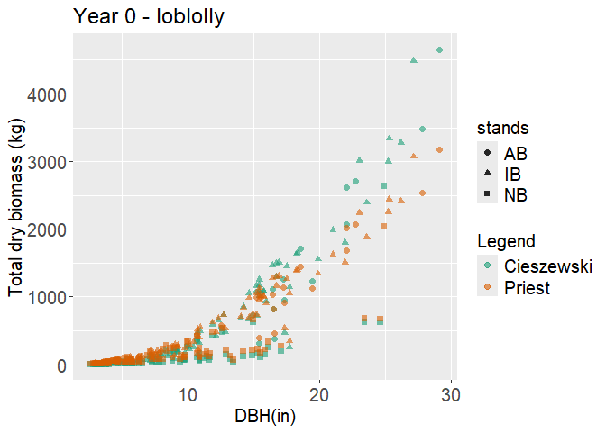
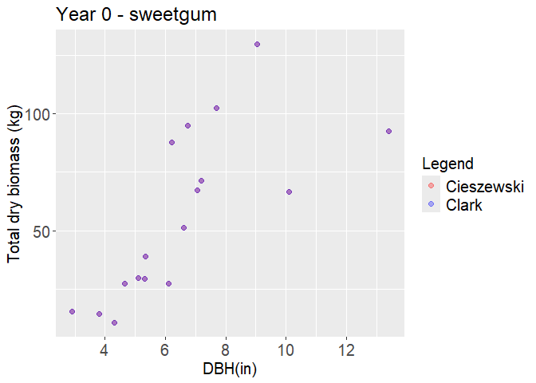

NPP estimation
================
Moeka
2022-05-18

``` r
veg_raw <- 
  read_sheet("https://docs.google.com/spreadsheets/d/1uaW8gF5nhk11R9ZDjq5ZD8kb0M_6ZE6fQQ7qwMbuWYM/edit#gid=2137031059",
             range = "summary", col_types = "ccccnnncn")
```

    ## ! Using an auto-discovered, cached token.

    ##   To suppress this message, modify your code or options to clearly consent to
    ##   the use of a cached token.

    ##   See gargle's "Non-interactive auth" vignette for more details:

    ##   <https://gargle.r-lib.org/articles/non-interactive-auth.html>

    ## ℹ The googlesheets4 package is using a cached token for 'mono@tamu.edu'.

    ## ✔ Reading from "CBCvegsurvey2020".

    ## ✔ Range ''summary''.

    ## Warning in .Primitive("as.double")(x, ...): NAs introduced by coercion

    ## Warning in .Primitive("as.double")(x, ...): NAs introduced by coercion

    ## Warning in .Primitive("as.double")(x, ...): NAs introduced by coercion

    ## Warning in .Primitive("as.double")(x, ...): NAs introduced by coercion

    ## Warning in .Primitive("as.double")(x, ...): NAs introduced by coercion

    ## Warning in .Primitive("as.double")(x, ...): NAs introduced by coercion

    ## Warning in .Primitive("as.double")(x, ...): NAs introduced by coercion

    ## Warning in .Primitive("as.double")(x, ...): NAs introduced by coercion

    ## Warning in .Primitive("as.double")(x, ...): NAs introduced by coercion

    ## Warning in .Primitive("as.double")(x, ...): NAs introduced by coercion

    ## Warning in .Primitive("as.double")(x, ...): NAs introduced by coercion

    ## Warning in .Primitive("as.double")(x, ...): NAs introduced by coercion

    ## Warning in .Primitive("as.double")(x, ...): NAs introduced by coercion

    ## Warning in .Primitive("as.double")(x, ...): NAs introduced by coercion

    ## Warning in .Primitive("as.double")(x, ...): NAs introduced by coercion

    ## Warning in .Primitive("as.double")(x, ...): NAs introduced by coercion

    ## Warning in .Primitive("as.double")(x, ...): NAs introduced by coercion

    ## Warning in .Primitive("as.double")(x, ...): NAs introduced by coercion

    ## Warning in .Primitive("as.double")(x, ...): NAs introduced by coercion

    ## Warning in .Primitive("as.double")(x, ...): NAs introduced by coercion

    ## Warning in .Primitive("as.double")(x, ...): NAs introduced by coercion

    ## Warning in .Primitive("as.double")(x, ...): NAs introduced by coercion

    ## Warning in .Primitive("as.double")(x, ...): NAs introduced by coercion

    ## Warning in .Primitive("as.double")(x, ...): NAs introduced by coercion

    ## Warning in .Primitive("as.double")(x, ...): NAs introduced by coercion

    ## Warning in .Primitive("as.double")(x, ...): NAs introduced by coercion

    ## Warning in .Primitive("as.double")(x, ...): NAs introduced by coercion

    ## Warning in .Primitive("as.double")(x, ...): NAs introduced by coercion

    ## Warning in .Primitive("as.double")(x, ...): NAs introduced by coercion

    ## Warning in .Primitive("as.double")(x, ...): NAs introduced by coercion

    ## Warning in .Primitive("as.double")(x, ...): NAs introduced by coercion

    ## Warning in .Primitive("as.double")(x, ...): NAs introduced by coercion

    ## Warning in .Primitive("as.double")(x, ...): NAs introduced by coercion

    ## Warning in .Primitive("as.double")(x, ...): NAs introduced by coercion

    ## Warning in .Primitive("as.double")(x, ...): NAs introduced by coercion

    ## Warning in .Primitive("as.double")(x, ...): NAs introduced by coercion

    ## Warning in .Primitive("as.double")(x, ...): NAs introduced by coercion

    ## Warning in .Primitive("as.double")(x, ...): NAs introduced by coercion

    ## Warning in .Primitive("as.double")(x, ...): NAs introduced by coercion

    ## Warning in .Primitive("as.double")(x, ...): NAs introduced by coercion

    ## Warning in .Primitive("as.double")(x, ...): NAs introduced by coercion

    ## Warning in .Primitive("as.double")(x, ...): NAs introduced by coercion

    ## Warning in .Primitive("as.double")(x, ...): NAs introduced by coercion

    ## Warning in .Primitive("as.double")(x, ...): NAs introduced by coercion

    ## Warning in .Primitive("as.double")(x, ...): NAs introduced by coercion

    ## Warning in .Primitive("as.double")(x, ...): NAs introduced by coercion

    ## Warning in .Primitive("as.double")(x, ...): NAs introduced by coercion

    ## Warning in .Primitive("as.double")(x, ...): NAs introduced by coercion

    ## Warning in .Primitive("as.double")(x, ...): NAs introduced by coercion

    ## Warning in .Primitive("as.double")(x, ...): NAs introduced by coercion

    ## Warning in .Primitive("as.double")(x, ...): NAs introduced by coercion

    ## Warning in .Primitive("as.double")(x, ...): NAs introduced by coercion

    ## Warning in .Primitive("as.double")(x, ...): NAs introduced by coercion

    ## Warning in .Primitive("as.double")(x, ...): NAs introduced by coercion

    ## Warning in .Primitive("as.double")(x, ...): NAs introduced by coercion

    ## Warning in .Primitive("as.double")(x, ...): NAs introduced by coercion

    ## Warning in .Primitive("as.double")(x, ...): NAs introduced by coercion

    ## Warning in .Primitive("as.double")(x, ...): NAs introduced by coercion

    ## Warning in .Primitive("as.double")(x, ...): NAs introduced by coercion

    ## Warning in .Primitive("as.double")(x, ...): NAs introduced by coercion

    ## Warning in .Primitive("as.double")(x, ...): NAs introduced by coercion

    ## Warning in .Primitive("as.double")(x, ...): NAs introduced by coercion

    ## Warning in .Primitive("as.double")(x, ...): NAs introduced by coercion

    ## Warning in .Primitive("as.double")(x, ...): NAs introduced by coercion

    ## Warning in .Primitive("as.double")(x, ...): NAs introduced by coercion

    ## Warning in .Primitive("as.double")(x, ...): NAs introduced by coercion

    ## Warning in .Primitive("as.double")(x, ...): NAs introduced by coercion

    ## Warning in .Primitive("as.double")(x, ...): NAs introduced by coercion

    ## Warning in .Primitive("as.double")(x, ...): NAs introduced by coercion

    ## Warning in .Primitive("as.double")(x, ...): NAs introduced by coercion

    ## Warning in .Primitive("as.double")(x, ...): NAs introduced by coercion

    ## Warning in .Primitive("as.double")(x, ...): NAs introduced by coercion

    ## Warning in .Primitive("as.double")(x, ...): NAs introduced by coercion

    ## Warning in .Primitive("as.double")(x, ...): NAs introduced by coercion

    ## Warning in .Primitive("as.double")(x, ...): NAs introduced by coercion

    ## Warning in .Primitive("as.double")(x, ...): NAs introduced by coercion

    ## Warning in .Primitive("as.double")(x, ...): NAs introduced by coercion

    ## Warning in .Primitive("as.double")(x, ...): NAs introduced by coercion

    ## Warning in .Primitive("as.double")(x, ...): NAs introduced by coercion

    ## Warning in .Primitive("as.double")(x, ...): NAs introduced by coercion

    ## Warning in .Primitive("as.double")(x, ...): NAs introduced by coercion

    ## Warning in .Primitive("as.double")(x, ...): NAs introduced by coercion

    ## Warning in .Primitive("as.double")(x, ...): NAs introduced by coercion

    ## Warning in .Primitive("as.double")(x, ...): NAs introduced by coercion

    ## Warning in .Primitive("as.double")(x, ...): NAs introduced by coercion

    ## Warning in .Primitive("as.double")(x, ...): NAs introduced by coercion

    ## Warning in .Primitive("as.double")(x, ...): NAs introduced by coercion

    ## Warning in .Primitive("as.double")(x, ...): NAs introduced by coercion

    ## Warning in .Primitive("as.double")(x, ...): NAs introduced by coercion

    ## Warning in .Primitive("as.double")(x, ...): NAs introduced by coercion

    ## Warning in .Primitive("as.double")(x, ...): NAs introduced by coercion

    ## Warning in .Primitive("as.double")(x, ...): NAs introduced by coercion

    ## Warning in .Primitive("as.double")(x, ...): NAs introduced by coercion

    ## Warning in .Primitive("as.double")(x, ...): NAs introduced by coercion

    ## Warning in .Primitive("as.double")(x, ...): NAs introduced by coercion

    ## Warning in .Primitive("as.double")(x, ...): NAs introduced by coercion

    ## Warning in .Primitive("as.double")(x, ...): NAs introduced by coercion

    ## Warning in .Primitive("as.double")(x, ...): NAs introduced by coercion

    ## Warning in .Primitive("as.double")(x, ...): NAs introduced by coercion

    ## Warning in .Primitive("as.double")(x, ...): NAs introduced by coercion

    ## Warning in .Primitive("as.double")(x, ...): NAs introduced by coercion

    ## Warning in .Primitive("as.double")(x, ...): NAs introduced by coercion

    ## Warning in .Primitive("as.double")(x, ...): NAs introduced by coercion

    ## Warning in .Primitive("as.double")(x, ...): NAs introduced by coercion

    ## Warning in .Primitive("as.double")(x, ...): NAs introduced by coercion

    ## Warning in .Primitive("as.double")(x, ...): NAs introduced by coercion

    ## Warning in .Primitive("as.double")(x, ...): NAs introduced by coercion

    ## Warning in .Primitive("as.double")(x, ...): NAs introduced by coercion

    ## Warning in .Primitive("as.double")(x, ...): NAs introduced by coercion

    ## Warning in .Primitive("as.double")(x, ...): NAs introduced by coercion

    ## Warning in .Primitive("as.double")(x, ...): NAs introduced by coercion

    ## Warning in .Primitive("as.double")(x, ...): NAs introduced by coercion

    ## Warning in .Primitive("as.double")(x, ...): NAs introduced by coercion

    ## Warning in .Primitive("as.double")(x, ...): NAs introduced by coercion

    ## Warning in .Primitive("as.double")(x, ...): NAs introduced by coercion

    ## Warning in .Primitive("as.double")(x, ...): NAs introduced by coercion

    ## Warning in .Primitive("as.double")(x, ...): NAs introduced by coercion

    ## Warning in .Primitive("as.double")(x, ...): NAs introduced by coercion

    ## Warning in .Primitive("as.double")(x, ...): NAs introduced by coercion

    ## Warning in .Primitive("as.double")(x, ...): NAs introduced by coercion

``` r
# veg1 <- veg_raw[,c(1:3,5:8,10)]
# 
# veg1$Stand <- substring(veg1$plot, 1,2)
# veg1$Plot <- substring(veg1$plot,4,4)

veg1 <- veg_raw
colnames(veg1)[5] <- "DBH_yr0_in"
colnames(veg1)[6] <- "DBH_yr1_in"
colnames(veg1)[7] <- "DBH_yr3_in"
colnames(veg1)[9] <- "h_ft"

head(veg1)
```

    ## # A tibble: 6 × 9
    ##   stands plot  ID    SPP       DBH_yr0_in DBH_yr1_in DBH_yr3_in Notes  h_ft
    ##   <chr>  <chr> <chr> <chr>          <dbl>      <dbl>      <dbl> <chr> <dbl>
    ## 1 AB     1     176   loblolly        7.25        7.5       7.62 <NA>   61.7
    ## 2 AB     1     177   loblolly       14.9        15.1      15.4  <NA>   78.4
    ## 3 AB     1     178   loblolly       12.5        13.1      13.5  <NA>   84.4
    ## 4 AB     1     179   water oak      19.5        20.0      20.6  <NA>   99.8
    ## 5 AB     1     180   sweetgum        6.6         6.7       6.57 <NA>   34.5
    ## 6 AB     1     181   elm             5.7         5.6       5.68 <NA>   42.4

``` r
veg1 <- veg1 %>%
  mutate(Diff_in = DBH_yr1_in - DBH_yr0_in) #%>%
  #mutate(Dead = grepl("burn|fall|dead", Notes, fixed = FALSE, ignore.case =TRUE))

ggplot(veg1) + 
  geom_point(aes(DBH_yr0_in, Diff_in, col = plot)) + facet_wrap(~stands) +
  theme_bw()
```

    ## Warning: Removed 32 rows containing missing values or values outside the scale range
    ## (`geom_point()`).

<!-- -->

``` r
# ID = 365 outlier <- removing. Didn't get detected two years
```

``` r
veg_plmean <- 
  veg1 %>%
  group_by(stands, plot) %>%
  summarise(DBH_yr0_avg_in=mean(DBH_yr0_in,na.rm = T),
            DBH_yr1_avg_in=mean(DBH_yr1_in,na.rm = T),
            Diff_avg_in=mean(Diff_in,na.rm = T)) %>%
  ungroup()
```

    ## `summarise()` has grouped output by 'stands'. You can override using the
    ## `.groups` argument.

``` r
#write.csv(veg_plmean, "G:/Shared drives/Project_CooksBranch/Data/VegSurvey/dbh_raw_pl.csv", row.names=FALSE)


#veg: for imputed dataframe
# impute: dbh_y0 = dbh_y1 - plot averaged tree growth
veg <- 
  left_join(veg1, veg_plmean, by = c("stands", "plot")) %>% 
  mutate(DBH_yr0_in = ifelse(is.na(DBH_yr0_in), DBH_yr1_in - Diff_avg_in, DBH_yr0_in))
```

``` r
ggplot(veg,aes(DBH_yr0_in, h_ft, col = plot)) + geom_point(size = 2) + facet_wrap(~stands) +
    theme_bw() +
    theme(axis.title.x = element_text(size = 15),axis.text.x = element_text(size = 15),
        axis.title.y = element_text(size = 15),axis.text.y = element_text(size = 15),
        title = element_text(size = 15),legend.text = element_text(size = 15)) 
```

    ## Warning: Removed 3 rows containing missing values or values outside the scale range
    ## (`geom_point()`).

<!-- -->

``` r
# veg_bm_rm <-veg_bm[veg_bm$h_ft < 100,] # 31 trees applied

# NA for questioning tree heights
veg_rm <- veg %>%
  mutate(h_ft = 
          case_when(stands == 'AB' & h_ft > 120 ~ NA,
                    stands == 'IB' & h_ft > 130 ~ NA,
                    stands == 'NB' & h_ft > 100 ~ NA,
                    TRUE ~ h_ft)) %>%
  filter(ID != c("131", "367", "365"))
  # 365: extreme growth, missing


ggplot(veg_rm,aes(DBH_yr0_in, h_ft, col = plot)) + geom_point(size = 2) + facet_wrap(~stands) +
    theme_bw() +
    theme(axis.title.x = element_text(size = 15),axis.text.x = element_text(size = 15),
        axis.title.y = element_text(size = 15),axis.text.y = element_text(size = 15),
        title = element_text(size = 15),legend.text = element_text(size = 15)) 
```

    ## Warning: Removed 8 rows containing missing values or values outside the scale range
    ## (`geom_point()`).

<!-- -->

``` r
# summary DBH & height
dbh_cbc_pl <- 
  veg_rm %>% 
  # unit conversion: inch to cm, feet to m
  mutate(across(ends_with("_in"), ~.*2.54),
         across(ends_with("_h"), ~.*.3048)) %>%
  group_by(stands, plot) %>% 
  summarise(across(where(is.double), 
                   list(mean = ~ mean(., na.rm = TRUE), 
                        sd = ~ sd(., na.rm = TRUE))),
                   .names = "{.col}_{.fn}") %>%
 knitr::kable(format = "simple")
```

    ## `summarise()` has grouped output by 'stands'. You can override using the
    ## `.groups` argument.

``` r
veg_rm %>% 
  group_by(stands) %>% 
  summarise(across(where(is.double), 
                   list(mean = ~ mean(., na.rm = TRUE), 
                        sd = ~ sd(., na.rm = TRUE)), 
                   .names = "{.col}_{.fn}")) %>%
  knitr::kable(format = "simple")
```

| stands | DBH_yr0_in_mean | DBH_yr0_in_sd | DBH_yr1_in_mean | DBH_yr1_in_sd | DBH_yr3_in_mean | DBH_yr3_in_sd | h_ft_mean |  h_ft_sd | Diff_in_mean | Diff_in_sd | DBH_yr0_avg_in_mean | DBH_yr0_avg_in_sd | DBH_yr1_avg_in_mean | DBH_yr1_avg_in_sd | Diff_avg_in_mean | Diff_avg_in_sd |
|:-------|----------------:|--------------:|----------------:|--------------:|----------------:|--------------:|----------:|---------:|-------------:|-----------:|--------------------:|------------------:|--------------------:|------------------:|-----------------:|---------------:|
| AB     |        9.845376 |      6.615267 |        9.904423 |      6.556881 |       10.590312 |      6.695985 |  53.77121 | 25.52509 |    0.1924752 |  0.2972353 |            9.817475 |          2.106558 |            9.938484 |          1.611822 |        0.1918624 |      0.0685191 |
| IB     |       12.054206 |      5.966662 |       12.412500 |      6.000381 |       13.006774 |      6.613793 |  68.11089 | 32.82029 |    0.1814103 |  0.4865802 |           12.080678 |          2.057050 |           12.366315 |          2.002215 |        0.1782434 |      0.1171206 |
| NB     |        7.529812 |      4.993129 |        7.819091 |      5.120586 |        7.955435 |      5.424193 |  32.89272 | 20.08918 |    0.2307647 |  1.1465456 |            7.478048 |          1.275933 |            7.822476 |          1.530020 |        0.2373170 |      0.2523727 |

## Allometroc eqiation

### Cieszewski et al 2021 in GA:

Eq 1 - Biomass per tree (kg) = 0.45359237 \* 10^(a+b \* log10((DBH_in^2)
\* h_ft)) \# Softwood Eq 2 - Biomass per tree (kg) = a \* (DBH_in ^2 \*
h_ft)^b \# Hardwood with DBH \< 11in Eq 3 - Biomass per tree (kg) = a \*
(DBH_in<sup>2)</sup>b \* h_ft^c \# Hardwood with DBH \> 11in
———————————————————————————

``` r
Eq1 <- function(a, b, DBH, h){0.45359237 * 10^(a + b * (log10( h * DBH^2)))} 
Eq2 <- function(a, b, DBH, h){a * ((DBH^2)*h)^b}
Eq3 <- function(a, b, c, DBH, h){a * (DBH^2)^b * h^c}
```

Shortleaf (dry with foliage): a = -1.55499, b = 1.12266 (Eq 1)

Loblolly (dry with foliage): a = -1.0293, b = 0.98788 (Eq 1)

Sweet gum (DBH \< 11in) (dry with foliage): A = 0.05152, b = 0.94351 (Eq
2) Sweet gum (DBH \> 11in) (dry with foliage): A = 0.01409, b = 1.2138,
c=0.94351 (Eq 3)

Other hardwood (DBH \< 11in) (dry with foliage): A = 0.07153, b = 0.938
(Eq 2) Other hardwood (DBH \> 11in) (dry with foliage): A = 0.02366, b =
1.16867, c=0.938 (Eq 3)

### Priest et al 2015 in east TX:

Eq 4 - Total abg biomass (kg) = a + b\* (DBH_cm^c) \* (h_m^d)

Loblolly (dry with foliage): a = 2.4584, b = 0.0779, c = 1.7712, d =
0.8581 (Eq 4)

``` r
Eq4 <- function(a, b, c, d, DBH, h){a + b * (conv_unit(DBH, 'inch',"cm")^c) * (conv_unit(h,'ft',"m")^d)}
```

### Jenkins et al 2003 US nationalwide

Eq 5 - Total abg biomass (kg) = (Exp a+b\*ln(DBH_cm))

mixed hardwood (elm, texas ash): b0= -2.48, b1=2.4835, \<dbh=56 cm (Eq
5)

``` r
Eq5 <- function(a, b, DBH){a + b * ln(conv_unit(DBH, "inch", "cm"))}
```

### Clark et al 1986 in east US

Eq 6 - Total dry biomass for DBH \< 11in (pd) = a \* (DBH_in^2*h_ft)^b
Eq 7 - Total dry biomass for DBH \> 11in (pd) = a *
(DBH_in<sup>2)</sup>b\*h_ft^c

South red oak (water oak) (DBH \< 11in): a = 0.16220, b = 0.95348 (Eq 6)

Elm (DBH \< 11in): a = 0.19128, b = 0.91936 (Eq 6)

Sweetgum (DBH \< 11in): a = 0.11357, b = 0.94351 (Eq 6) Sweetgum (DBH \>
11in): a = 0.03107, b = 1.21380, c = 0.94351 (Eq 7)

``` r
Eq6 <- function(a, b, DBH, h){conv_unit(a * ((DBH^2)*h)^b, "lbs", "kg")}
Eq7 <- function(a, b, c, DBH, h){conv_unit(a * ((DBH^2)^b)*(h^c), "lbs", "kg")}
```

### Tiller et al 2017 in east TX

Eq 8 - Total abg biomass (g) = 39.09169 \* DBH_cm^1.83881 \* h_m^1.02427
\* 1.04914 (yaupon)

``` r
Eq8 <- function(DBH, h){39.09169 * (conv_unit(DBH, "inch", "cm")^1.83881) * (conv_unit(h, "inch", "m")^1.02427) * 1.04914*0.001}
```

## Selection of allometric equation

There are two options for loblolly pines  
Cieszewski et al 2021 from GA or Priest et al 2015 from TX.

``` r
lob <- veg_rm[(veg_rm$SPP == 'loblolly'|veg_rm$SPP == 'pine') & is.na(veg_rm$SPP) != T,]

lob <- lob %>%
  mutate(eq1 = Eq1(-1.55499, 1.12266, DBH_yr0_in, h_ft)) %>%
  mutate(eq4 = Eq4(a = 2.4584, b = 0.0779, c = 1.7712, d = 0.8581, DBH_yr0_in, h_ft))

col_lob <- c("Cieszewski" = "red", "Priest" = "blue")

ggplot(lob,aes(x = DBH_yr0_in,  shape = stands))+ 
  geom_point(aes(y= eq1, colour = "Cieszewski"), alpha = .6, size = 2) +
  geom_point(aes(y= eq4, colour = "Priest"), alpha = .6, size = 2) +
  labs(x='DBH(in)', y= 'Total dry biomass (kg)', colour = 'Legend') + 
  ggtitle('Year 0 - loblolly')+ scale_color_manual(values = col_lob) +
  theme(axis.title.x = element_text(size = 15),axis.text.x = element_text(size = 15),
        axis.title.y = element_text(size = 15),axis.text.y = element_text(size = 15),
        title = element_text(size = 15),legend.text = element_text(size = 15)) +
  scale_color_brewer(palette = "Dark2") 
```

    ## Scale for colour is already present.
    ## Adding another scale for colour, which will replace the existing scale.

    ## Warning: Removed 7 rows containing missing values or values outside the scale range
    ## (`geom_point()`).
    ## Removed 7 rows containing missing values or values outside the scale range
    ## (`geom_point()`).

<!-- --> The equation
from Priest provided the lower total dry biomass at the greater DBH,
which seems to be a better estimation. So, will use Priest for the
analysis.

There are two options for sweetgum: Cieszewski et al 2021 from GA or
Clark et al 1986 in east US.

``` r
sg <- veg_rm[veg_rm$SPP == "sweetgum" & is.na(veg_rm$SPP) != T,]

for(i in 1:nrow(sg)){
  if(sg$DBH_yr0_in[i] < 11){
      sg$Cieszewski[i] = Eq2(0.05152, 0.94351, sg$DBH_yr0_in[i], sg$h_ft[i])
      sg$Clark[i] = Eq6(0.11357, 0.94351, sg$DBH_yr0_in[i], sg$h_ft[i])
  } else{
      sg$Cieszewski[i] = Eq3(0.01409, 1.2138, 0.94351, sg$DBH_yr0_in[i], sg$h_ft[i])
      sg$Clark[i] = Eq7(0.03107, 1.21380, 0.94351, sg$DBH_yr0_in[i], sg$h_ft[i])
  }
  }
```

    ## Warning: Unknown or uninitialised column: `Cieszewski`.

    ## Warning: Unknown or uninitialised column: `Clark`.

``` r
col_sg <- c("Cieszewski" = "red", "Clark" = "blue")

ggplot(sg,aes(x = DBH_yr0_in))+ 
  geom_point(aes(y= Cieszewski, colour = "Cieszewski"), alpha = .3, size = 2) +
  geom_point(aes(y= Clark, colour = "Clark"), alpha = .3, size = 2) +
  labs(x='DBH(in)', y= 'Total dry biomass (kg)', colour = 'Legend') + 
  ggtitle('Year 0 - sweetgum')+ scale_color_manual(values = col_sg) +
  theme(axis.title.x = element_text(size = 15),axis.text.x = element_text(size = 15),
        axis.title.y = element_text(size = 15),axis.text.y = element_text(size = 15),
        title = element_text(size = 15),legend.text = element_text(size = 15)) 
```

<!-- -->

Since the equations in Cieszewski et al 2021 were developed with Clark
et al 1986, both of them were very similar. Thus, decided to use the
newer Cieszewski et al 2021.

There are 2 elm trees: Clark and Jenkins.

``` r
veg_rm[veg_rm$SPP == 'elm',]
```

    ## # A tibble: 21 × 13
    ##    stands plot  ID    SPP   DBH_yr0_in DBH_yr1_in DBH_yr3_in Notes  h_ft Diff_in
    ##    <chr>  <chr> <chr> <chr>      <dbl>      <dbl>      <dbl> <chr> <dbl>   <dbl>
    ##  1 AB     1     181   elm          5.7       5.6        5.68 <NA>   42.4 -0.100 
    ##  2 AB     1     184   elm          4         4          4.05 <NA>   23.1  0     
    ##  3 AB     3     111   elm          3.8       3.9        3.94 <NA>   28.2  0.100 
    ##  4 AB     3     112   elm          5.4       5.45       5.55 <NA>   33.6  0.0500
    ##  5 AB     3     113   elm          5.7       5.8        5.91 <NA>   41.5  0.100 
    ##  6 AB     3     116   elm          5.8       5.9        6.19 <NA>   37.1  0.100 
    ##  7 AB     3     117   elm          3.7       3.9        4.1  <NA>   26.9  0.200 
    ##  8 AB     3     119   elm          5.5       6.1        6.1  <NA>   52.9  0.600 
    ##  9 <NA>   <NA>  <NA>  <NA>        NA        NA         NA    <NA>   NA   NA     
    ## 10 <NA>   <NA>  <NA>  <NA>        NA        NA         NA    <NA>   NA   NA     
    ## # ℹ 11 more rows
    ## # ℹ 3 more variables: DBH_yr0_avg_in <dbl>, DBH_yr1_avg_in <dbl>,
    ## #   Diff_avg_in <dbl>

``` r
Eq5(-2.48, 2.4835,5)
```

    ## [1] 3.832069

``` r
Eq6(a = 0.19128, b = 0.91936,5,37.6)
```

    ## [1] 46.95806

``` r
Eq5(-2.48, 2.4835,4.2)
```

    ## [1] 3.399062

``` r
Eq6(a = 0.19128, b = 0.91936,4.2,44.9)
```

    ## [1] 40.11673

Eq 5- Jenkins is more reliable when comparing with Tiller et al.

for trees without heights:

biomass (kg) = exp(b0 + b1\*ln(DBH(in))

Pine: b0 = -2.5356, b1 = 2.4349 Hard maple/oak/hickory/beech: b0 =
-2.0127, b1 = 2.4342 mixed hardwood (elm, texas ash): b0= -2.48,
b1=2.4835, \<dbh=56 cm (Eq 5)

``` r
unique(veg_rm$SPP)
```

    ##  [1] "loblolly"         "water oak"        "sweetgum"         "elm"             
    ##  [5] "texas ash"        "elm?"             "oak?"             "sweetgum?"       
    ##  [9] "shortleaf"        "American elm"     "Southern red oak" "Mexican ash?"    
    ## [13] "unknown oak"      "oak"              NA                 "?"               
    ## [17] "pine"             "bur oak?"         "yaupon"           "black jack oak"  
    ## [21] "yaupon?"

``` r
veg_bm<- veg_rm %>% 
  mutate(bm_yr0_kg = case_when(
    grepl("loblolly|pine", SPP, fixed = F, ignore.case = T) & !is.na(h_ft) ~ Eq4(a = 2.4584, b = 0.0779, c = 1.7712, d = 0.8581, DBH_yr0_in, h_ft), # Priest
    grepl("shortleaf", SPP, fixed = F, ignore.case = T) ~ Eq1(a = -1.55499, b = 1.12266, DBH_yr0_in, h_ft), # Cieszewski
    grepl("elm|ash", SPP, fixed = F, ignore.case = T) ~ Eq5(-2.48, 2.4835, DBH_yr0_in),  # Jenkins
    grepl("yaupon", SPP, fixed = F, ignore.case = T) ~ Eq8(DBH_yr0_in, h_ft), # Tiller
    grepl("sweetgum", SPP, fixed = F, ignore.case = T) & DBH_yr0_in < 11 ~ Eq2(0.05152, 0.94351, DBH_yr0_in, h_ft), # Cieszewski
    grepl("sweetgum", SPP, fixed = F, ignore.case = T) & DBH_yr0_in >= 11 ~ Eq3(0.01409, 1.2138, 0.94351, DBH_yr0_in, h_ft), # Cieszewski
    grepl("oak|?", SPP, fixed = F, ignore.case = T) & DBH_yr0_in < 11 & !is.na(h_ft)| is.na(SPP) ~ Eq2(0.07153, 0.938, DBH_yr0_in, h_ft), # Cieszewski
    grepl("oak|?", SPP, fixed = F, ignore.case = T) & DBH_yr0_in >= 11 & !is.na(h_ft) | is.na(SPP) ~ Eq3(0.02366, 1.16867, 0.938, DBH_yr0_in, h_ft), # Cieszewski
    # without heights
    grepl("loblolly", SPP, fixed = F, ignore.case = T) & is.na(h_ft) ~ exp(-2.5356+2.4349*ln(conv_unit(DBH_yr0_in, "inch", "cm"))), # Jenkins
    grepl("oak", SPP, fixed = F, ignore.case = T) & is.na(h_ft) == T~ exp(-2.0127+2.4342*ln(conv_unit(DBH_yr0_in, "inch", "cm"))) # Jenkins
    
  )) %>%
  mutate(bm_yr1_kg = case_when(
    grepl("loblolly|pine", SPP, fixed = F, ignore.case = T) & !is.na(h_ft) ~ Eq4(a = 2.4584, b = 0.0779, c = 1.7712, d = 0.8581, DBH_yr1_in, h_ft), # Priest
    grepl("shortleaf", SPP, fixed = F, ignore.case = T) ~ Eq1(a = -1.55499, b = 1.12266, DBH_yr1_in, h_ft), # Cieszewski
    grepl("elm|ash", SPP, fixed = F, ignore.case = T) ~ Eq5(-2.48, 2.4835, DBH_yr1_in),  # Jenkins
    grepl("yaupon", SPP, fixed = F, ignore.case = T) ~ Eq8(DBH_yr1_in, h_ft), # Tiller
    grepl("sweetgum", SPP, fixed = F, ignore.case = T) & DBH_yr1_in < 11 ~ Eq2(0.05152, 0.94351, DBH_yr1_in, h_ft), # Cieszewski
    grepl("sweetgum", SPP, fixed = F, ignore.case = T) & DBH_yr1_in >= 11 ~ Eq3(0.01409, 1.2138, 0.94351, DBH_yr1_in, h_ft), # Cieszewski
    grepl("oak|?", SPP, fixed = F, ignore.case = T) & DBH_yr1_in < 11 & !is.na(h_ft)  | is.na(SPP) ~ Eq2(0.07153, 0.938, DBH_yr1_in, h_ft), # Cieszewski
    grepl("oak|?", SPP, fixed = F, ignore.case = T) & DBH_yr1_in >= 11 & !is.na(h_ft)  | is.na(SPP) ~ Eq3(0.02366, 1.16867, 0.938, DBH_yr1_in, h_ft), # Cieszewski
    # without heights
    grepl("loblolly", SPP, fixed = F, ignore.case = T) & is.na(h_ft) ~ exp(-2.5356+2.4349*ln(conv_unit(DBH_yr1_in, "inch", "cm"))), # Jenkins
    grepl("oak", SPP, fixed = F, ignore.case = T) & is.na(h_ft) ~ exp(-2.0127+2.4342*ln(conv_unit(DBH_yr1_in, "inch", "cm"))) # Jenkins
  )) %>% 
  
  mutate(bm_yr0_kg_Jenkins = case_when(
    grepl("loblolly|pine|shortleaf", SPP, fixed = F, ignore.case = T) ~ exp(-2.5356+2.4349*ln(conv_unit(DBH_yr0_in, "inch", "cm"))),
    grepl("oak", SPP, fixed = F, ignore.case = T) ~ exp(-2.0127+2.4342*ln(conv_unit(DBH_yr0_in, "inch", "cm"))),
    grepl("elm", SPP, fixed = F, ignore.case = T) ~ exp(-2.2118+2.4133*ln(conv_unit(DBH_yr0_in, "inch", "cm"))),
    grepl("ash", SPP, fixed = F, ignore.case = T) ~ exp(-2.0314+2.3524*ln(conv_unit(DBH_yr0_in, "inch", "cm"))),
    grepl("sweetgum", SPP, fixed = F, ignore.case = T) ~ exp(-2.6390+2.5466*ln(conv_unit(DBH_yr0_in, "inch", "cm"))),
    TRUE ~ exp(-2.48+2.4835*ln(conv_unit(DBH_yr0_in, "inch", "cm")))
  )) %>%
  
   mutate(bm_yr1_kg_Jenkins = case_when(
    grepl("loblolly|pine|shortleaf", SPP, fixed = F, ignore.case = T) ~ exp(-2.5356+2.4349*ln(conv_unit(DBH_yr1_in, "inch", "cm"))),
    grepl("oak", SPP, fixed = F, ignore.case = T) ~ exp(-2.0127+2.4342*ln(conv_unit(DBH_yr1_in, "inch", "cm"))),
    grepl("elm", SPP, fixed = F, ignore.case = T) ~ exp(-2.2118+2.4133*ln(conv_unit(DBH_yr1_in, "inch", "cm"))),
    grepl("ash", SPP, fixed = F, ignore.case = T) ~ exp(-2.0314+2.3524*ln(conv_unit(DBH_yr1_in, "inch", "cm"))),
    grepl("sweetgum", SPP, fixed = F, ignore.case = T) ~ exp(-2.6390+2.5466*ln(conv_unit(DBH_yr1_in, "inch", "cm"))),
    TRUE ~ exp(-2.48+2.4835*ln(conv_unit(DBH_yr1_in, "inch", "cm")))
  ))
  
  

# plot
ggplot(veg_bm, aes(x=plot, y=bm_yr0_kg))+geom_boxplot()+facet_wrap(~stands)+
  ylab('Biomass (kg)') + ggtitle('Year 0 - Total dry biomass (kg)')+ 
  theme_bw() +
  theme(axis.title.x = element_text(size = 15),axis.text.x = element_text(size = 15),
        axis.title.y = element_text(size = 15),axis.text.y = element_text(size = 15),
        title = element_text(size = 15), strip.text = element_text(size=15)) 
```

<!-- -->

``` r
ggplot(veg_bm, aes(x=bm_yr0_kg, y=bm_yr0_kg_Jenkins))+geom_point()+facet_wrap(~stands)+
  labs(x = "with height", y = "w/o height by Jenkins") + ggtitle('With heights vs Without heights by Jenkins')+ 
  theme_bw() + geom_abline(intercept = 0, slope = 1) + 
  theme(axis.title.x = element_text(size = 15),axis.text.x = element_text(size = 15),
        axis.title.y = element_text(size = 15),axis.text.y = element_text(size = 15),
        title = element_text(size = 15), strip.text = element_text(size=15)) 
```

<!-- -->

Biomass ratio from Jenkins pp.24

ratio = Exp(b0 + b1/dbh)

hardwood: b0 = -1.6911, b1 = -0.8160 softwood: b0 = -1.5619, b1 = 0.6614

``` r
veg_bm_bg <- 
  veg_bm %>% 
  mutate(ratio_yr0_new = exp(-1.4485 -0.03476 *ln(conv_unit(DBH_yr0_in, "inch", "cm"))),
         ratio_yr1_new = exp(-1.4485 -0.03476 *ln(conv_unit(DBH_yr1_in, "inch", "cm"))),
         ratio_yr0_old = 
           case_when(grepl("loblolly|pine|shortleaf", SPP, fixed = F, ignore.case = T) ~ 
           exp(-1.6911 -0.03476/(conv_unit(DBH_yr0_in, "inch", "cm"))),
           TRUE ~ exp(-1.5619 + 0.6614/(conv_unit(DBH_yr0_in, "inch", "cm")))),
         ratio_yr1_old = 
           case_when(grepl("loblolly|pine|shortleaf", SPP, fixed = F, ignore.case = T) ~ 
           exp(-1.6911 -0.03476/(conv_unit(DBH_yr1_in, "inch", "cm"))),
           TRUE ~ exp(-1.5619 + 0.6614/(conv_unit(DBH_yr1_in, "inch", "cm"))))) %>%
  mutate(bm_cr_yr0_kg = bm_yr0_kg*ratio_yr0_new,
         bm_cr_yr1_kg = bm_yr1_kg*ratio_yr1_new,
         bm_cr_yr0_kg_old = bm_yr0_kg*ratio_yr0_old,
         bm_cr_yr1_kg_old = bm_yr1_kg*ratio_yr1_old
         
         )
```

``` r
Plot_info <-
  veg_rm %>% 
  select(c(stands, plot, ID)) %>%
  group_by(stands, plot) %>% 
  summarise(n = n()) %>%
  data.frame(
  r_ft=c(48,45,50.48,45.75,
         53.85,51.51,47.72,49.8,
         30.36,50,54.91,50.24)) %>%
  mutate(Area_ft2 = pi * r_ft^2) %>%
  mutate(Area_m2 = conv_unit(Area_ft2, "ft2", "m2")) %>%
  # 1 m2 = 0.00247405 acre
  mutate(density_acre = n/(Area_m2*0.000247105))
```

    ## `summarise()` has grouped output by 'stands'. You can override using the
    ## `.groups` argument.

## NPP estimation

Two approaches in Clark et al 2001 pp.359 were applied: Approach 1:
Tracking individual surviving trees. Stand increment = sum of individual
SURVIVING tree biomass increments + increment of ingrowth for new trees

Approach 2: Measuring all trees in the stand at each census. Stand
increment = (sum of the biomass at t2 - sum of the biomass at t1) + sum
of the biomass that died in the interval - (biomass of a minimum size
tree x number of new trees)

``` r
# plot summary
veg_summary <- 
  merge(veg_bm_bg, Plot_info,  by=c("stands", "plot")) %>%
  # unit: kg/m2 -> gC/m2
  mutate(bm_yr0_kg_m2 = bm_yr0_kg/Area_m2,
         bm_yr1_kg_m2 = bm_yr1_kg/Area_m2,
         bm_cr_yr0_kg_m2 = bm_cr_yr0_kg/Area_m2,
         bm_cr_yr1_kg_m2 = bm_cr_yr1_kg/Area_m2,
         bm_cr_yr0_kg_m2_old = bm_cr_yr0_kg_old/Area_m2,
         bm_cr_yr1_kg_m2_old = bm_cr_yr1_kg_old/Area_m2) %>%
  group_by(stands,plot) %>%
  summarise(
    across(c(bm_yr0_kg_m2, bm_yr1_kg_m2, bm_cr_yr0_kg_m2, bm_cr_yr1_kg_m2, bm_cr_yr0_kg_m2_old, bm_cr_yr1_kg_m2_old), 
                   list(sum = sum, sd = sd), na.rm = T))
```

    ## Warning: There was 1 warning in `summarise()`.
    ## ℹ In argument: `across(...)`.
    ## ℹ In group 1: `stands = "AB"` and `plot = "1"`.
    ## Caused by warning:
    ## ! The `...` argument of `across()` is deprecated as of dplyr 1.1.0.
    ## Supply arguments directly to `.fns` through an anonymous function instead.
    ## 
    ##   # Previously
    ##   across(a:b, mean, na.rm = TRUE)
    ## 
    ##   # Now
    ##   across(a:b, \(x) mean(x, na.rm = TRUE))

    ## `summarise()` has grouped output by 'stands'. You can override using the
    ## `.groups` argument.

``` r
veg_summary_st <- 
  veg_summary %>%
  group_by(stands) %>%
  summarize(across(ends_with("sum"), list(mean = mean, sd = sd)))
```

``` r
veg_npp1 <- veg_bm_bg %>%
  #filter(Dead == FALSE) %>%
  group_by(stands,plot) %>%
  mutate(App1 = bm_yr1_kg - bm_yr0_kg,
         cr_diff = bm_cr_yr1_kg - bm_cr_yr0_kg,
         cr_diff_old = bm_cr_yr1_kg_old - bm_cr_yr0_kg_old) %>%
  summarise(NPP_app1 = sum(App1, na.rm = T),
            NPP_cr = sum(cr_diff, na.rm = T),
            NPP_cr_old = sum(cr_diff_old, na.rm = T)) %>%
  ungroup() 
```

    ## `summarise()` has grouped output by 'stands'. You can override using the
    ## `.groups` argument.

``` r
veg_npp <- 
  veg_bm_bg %>%
  mutate(App2 = case_when(is.na(bm_yr1_kg - bm_yr0_kg) == T ~ bm_yr0_kg,
                          TRUE ~ bm_yr1_kg - bm_yr0_kg)) %>%
  group_by(stands,plot) %>%
  summarise(NPP_app2=sum(App2)) %>%
  ungroup() %>%
  right_join(veg_npp1, by=c("stands", "plot"))
```

    ## `summarise()` has grouped output by 'stands'. You can override using the
    ## `.groups` argument.

``` r
# plot summary
veg_npp_summary <- 
  merge(veg_npp, Plot_info,  by=c("stands", "plot")) %>%
  # unit: kg/m2 -> gC/m2
  mutate(veg_npp1_kg_m2 = NPP_app1/Area_m2, 
         veg_npp2_kg_m2 = NPP_app2/Area_m2,
         npp_cr_kg_m2 = NPP_cr/Area_m2,
         npp_cr_kg_m2_old = NPP_cr_old/Area_m2)
# m2 to ha: m2 * 0.0001 

# Stand level
## Unit gC/m2
veg_npp_summary %>%
  group_by(stands) %>%
  summarise(across(veg_npp1_kg_m2:npp_cr_kg_m2_old, 
                   list(mean = ~ mean(., na.rm = TRUE), 
                        sd = ~ sd(., na.rm = TRUE)), 
                   .names = "{.col}_{.fn}")) %>%
  knitr::kable(format = "simple")
```

| stands | veg_npp1_kg_m2_mean | veg_npp1_kg_m2_sd | veg_npp2_kg_m2_mean | veg_npp2_kg_m2_sd | npp_cr_kg_m2_mean | npp_cr_kg_m2_sd | npp_cr_kg_m2_old_mean | npp_cr_kg_m2_old_sd |
|:-------|--------------------:|------------------:|--------------------:|------------------:|------------------:|----------------:|----------------------:|--------------------:|
| AB     |           0.5325091 |         0.4094941 |           0.6122747 |         0.3995523 |         0.1079830 |       0.0815146 |             0.1078675 |           0.0826307 |
| IB     |           0.4863786 |         0.2686278 |           0.5049794 |         0.2539847 |         0.0984325 |       0.0540318 |             0.0906976 |           0.0486710 |
| NB     |           0.7006312 |         0.6210709 |           0.7639276 |         0.6990979 |         0.1435604 |       0.1281373 |             0.1403915 |           0.1326699 |

## Data analysis

``` r
knitr::opts_chunk$set(eval = FALSE)
library(tidyverse)
library(rstatix)
library(ggpubr) 
# source: http://www.sthda.com/english/articles/24-ggpubr-publication-ready-plots/76-add-p-values-and-significance-levels-to-ggplots/
# https://rpkgs.datanovia.com/ggpubr/reference/ggboxplot.html

my_comparisons <- list(c("AB", "IB"),c("IB", "NB"), c("AB", "NB"))

# APP 1
compare_means(veg_npp1_area~Stand, data = veg_npp_area, "t.test")

ggboxplot(veg_npp_area, x = "Stand", y = "veg_npp1_area", color = 'Stand',
          title = 'App 1 - Total dry biomass (kg m-2 yr-1)', ylab = "Biomass per area", font.label = list(size = 14))+
  stat_compare_means(comparisons = my_comparisons, method = 't.test')
   

# App 2
compare_means(veg_npp2_area~Stand, data = veg_npp_area, "t.test")
ggboxplot(veg_npp_area, x = "Stand", y = "veg_npp2_area", color = 'Stand',
          title = 'App 2 - Total dry biomass (kg m-2 yr-1)', ylab = "Biomass per area", font.label = list(size = 14))+
    stat_compare_means(comparisons = my_comparisons, method = 't.test')
```
